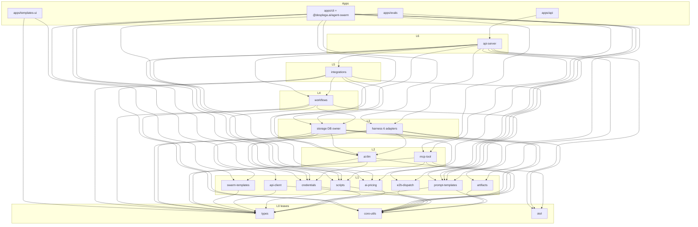

# Agent Swarm Monorepo Restructure — Collapsed-First Plan

## 1. Executive Summary

This is the pragmatic, **collapsed-first** revision of the monorepo restructure. Instead of the maximal 39-package / 46-workspace split, we ship **18 internal `@swarm/*` packages + 7 apps = 25 workspaces**. The published artifact (`@desplega.ai/agent-swarm`) stays byte-for-byte stable for consumers, and the dependency graph is a verified, strictly-acyclic DAG (7 lib layers L0–L6 + apps at L7).

**The four genuine source-level cycles are already broken** — they landed in two open PRs off `main` (PR #820, PR #822) ahead of the restructure (see §5). So the highest-risk refactors that the maximal plan listed as preconditions are **done**; this plan is now mostly *mechanical relocation* of an already-acyclic source tree into package dirs.

**What changes vs. the maximal plan**

- 39 internal packages → **18**. We collapse the eight "portable-core + db-adapter" and "per-provider / per-integration" splits into cohesive units (`harness` = core + 6 adapters; `integrations` = all providers; `workflows` = core + swarm; `scripts` = sandbox + sdk; memory + pages fold into `storage`), while keeping two shared leaves explicit (`e2b-dispatch`, `swarm-templates`).
- Same toolchain decision as the maximal plan: **Bun workspaces as sole PM + Turborepo + Changesets-when-a-2nd-package-publishes**, source-only internal packages, no TS project references (§6, summarized — full derivation in the 2026-06-25 doc §5).
- Same publish posture: **publish almost nothing day-1** — only the bundled `@desplega.ai/agent-swarm` CLI; `api-client` / `scripts`-sdk / `types` are publish-*eligible* but deferred (§7).

**Package count:** 18 `@swarm/*` + 7 apps = **25 workspaces** (vs 46). The collapse spec estimated ~13–15 internal; the explicit mapping enumerates 18 (we keep `api-client` net-new, the shared `e2b-dispatch` + `swarm-templates` leaves, and `artifacts` as dependency-isolated standalone units rather than fold them).

**Acyclicity guarantee:** verified by Kahn's algorithm over the collapsed graph — `ACYCLIC: true`, all 25 nodes emitted, a valid topological order exists (§4.3). `storage` is depended on by **exactly** `{api-server, workflows, integrations}`; `apps/cli` does **not** reach `storage` (only `api-client`).

---

## 2. Why Collapsed-First

The boilerplate tax of the maximal split is real: 46 `package.json` + 46 thin `tsconfig.json`, 46 `workspace:*` dep lists to keep honest, a 46-node Turbo graph, and a `dependency-cruiser` config encoding 8 layers — all to model a source tree that is **already acyclic** once the four cycle-breaks land. Most of those 39 packages have exactly one consumer (`api-server`), so the package boundary buys nothing over a directory boundary today.

Collapsed-first keeps the load-bearing structural wins — DB-ownership as a *structural* boundary (`storage` is the sole `bun:sqlite` owner; `apps/cli` physically cannot import it), the prompt-registry enforcement point, the worker/API HTTP split via `api-client` — at **half the workspace count**. Each collapsed unit that the maximal plan splits (`harness`→6 adapters, `integrations`→per-provider, `workflows`→core/swarm, `scripts`→core/sdk, memory→`memory-core`+stores) is split **later, when a real second consumer appears**, using the 2026-06-25 doc as the cut sheet (§8). Until then, a directory inside a package is free; a package is not.

This matches the maintainer's own steer in the maximal plan (Open Question #1, "Recommendation: start collapsed; split when a 2nd consumer appears") and Open Question #2 ("defer the StoragePort; one implementor doesn't justify the abstraction").

---

## 3. Target Structure

### 3.1 Tree (annotated)

```
agent-swarm/
├── package.json                 # root: workspaces[], catalog:, turbo + changeset scripts
├── bun.lock                     # SINGLE lockfile (ui/templates-ui migrated off pnpm)
├── turbo.json                   # build / typecheck / test / lint / boundary tasks
├── tsconfig.base.json           # one set of compiler flags; every pkg `extends` this
├── .dependency-cruiser.cjs      # encodes the LAYER DAG (replaces grep boundary guards)
├── biome.json                   # single root lint/format config
│
├── packages/
│   ├── types/                   # L0  @swarm/types          (model-tiers merged ✓ PR#820)
│   ├── core-utils/              # L0  @swarm/core-utils      (interpolate ✓ PR#820; +ctx-window +vcs)
│   ├── otel/                    # L0  @swarm/otel
│   ├── ai-pricing/              # L1  @swarm/ai-pricing      (ships cache.json asset)
│   ├── credentials/             # L1  @swarm/credentials     (codex-oauth + pool + resolution)
│   ├── prompt-templates/        # L1  @swarm/prompt-templates (injected DB resolver)
│   ├── artifacts/               # L1  @swarm/artifacts       (artifact-sdk)
│   ├── scripts/                 # L1  @swarm/scripts         (DB-free sandbox + sdk + allowlist)
│   ├── api-client/              # L1  @swarm/api-client      (NET-NEW typed worker HTTP client, GENERATED)
│   ├── e2b-dispatch/            # L1  @swarm/e2b-dispatch    (E2B dispatch + env prep; shared by cli + evals)
│   ├── swarm-templates/         # L1  @swarm/swarm-templates (templates/ data + schema; schema types → @swarm/types)
│   ├── ai-llm/                  # L2  @swarm/ai-llm          (internal-ai; raters hoist+fold at extraction, Phase 3)
│   ├── mcp-tool/                # L2  @swarm/mcp-tool
│   ├── harness/                 # L3  @swarm/harness         (core factory + 6 adapters as subpaths)
│   ├── storage/                 # L3  @swarm/storage         (THE DB owner; folds memory + pages)
│   ├── workflows/               # L4  @swarm/workflows       (engine + swarm exec + scheduler)
│   ├── integrations/            # L5  @swarm/integrations    (all providers as subpaths)
│   └── api-server/              # L6  @swarm/api-server      (integration hub)
│
├── apps/
│   ├── api/                     # boots @swarm/api-server; owns initDb + pricing seed
│   ├── cli/                     # @desplega.ai/agent-swarm (worker/lead/hook bins; e2b via @swarm/e2b-dispatch)
│   ├── ui/                      # Next.js dashboard (port 5274)
│   ├── templates-ui/            # Next.js templates registry (uses @swarm/swarm-templates)
│   ├── evals/                   # eval harness (own package; e2b via @swarm/e2b-dispatch)
│   │   └── ui/                  # evals dashboard
│
├── docs-site/                   # Fumadocs site (stays at repo root)
├── templates/                   # → @swarm/swarm-templates package (data + schema.ts; schema types fold into @swarm/types)
├── plugin/                      # UNCHANGED — stays at repo root, out of the split
├── runbooks/, thoughts/, mockups/   # unchanged
├── charts/agent-swarm/          # Chart.yaml version anchor (synced from apps/cli pkg)
└── scripts/                     # boundary guards + codemod + generators (repoint paths)
```

`docs-site/`, `charts/`, `runbooks/`, `thoughts/`, `mockups/`, `plugin/` stay where they are. The split touches `src/`, `ui/`, `templates-ui/`, `evals/`. `templates/` becomes the **`@swarm/swarm-templates` package** (data + schema; see §3.3 refinement #1).

### 3.2 Package table

Layers are integer longest-path layers (L0 = leaf, zero internal deps), computed and verified in §4. Apps are sinks placed at the nominal top layer (L7).

| Package | Dir | L | Purpose | Key source modules | dependsOn (internal) | Pub? |
|---|---|---|---|---|---|---|
| `@swarm/types` | `packages/types` | 0 | Zod schema + TS registry; **model-tiers merged** (✓ PR#820) | `src/types.ts` (incl `model-tiers`), `src/tracker/types.ts` | — | yes¹ |
| `@swarm/core-utils` | `packages/core-utils` | 0 | Cross-cutting leaf utils for api+worker; **`interpolate` moved in** (✓ PR#820); folds context-window math + `detectVcsProvider` | `src/utils/{api-key,secret-scrubber,constants,crypto,context-window}.ts`, `src/utils/template.ts` (interpolate), `src/be/{date-utils,swarm-config-guard,skill-parser}.ts`, `src/hooks/tool-loop-detection.ts`, `src/vcs/` | — | yes¹ |
| `@swarm/otel` | `packages/otel` | 0 | otel facade + lazy impl + telemetry + error-tracker (isolated heavy deps) | `src/otel.ts`, `otel-impl.ts`, `telemetry.ts`, `src/utils/error-tracker.ts` | — | int |
| `@swarm/ai-pricing` | `packages/ai-pricing` | 1 | models.dev snapshot + normalize + **pure** seed-row builder; ships `cache.json` asset (ui/evals consume) | `src/be/modelsdev-cache.ts(.json)`, `pricing-normalize.ts`, `seed-pricing.ts` (pure only) | `types` | int |
| `@swarm/credentials` | `packages/credentials` | 1 | Worker-side FS+PKCE codex OAuth store **+** credential-pool maps + harness-provider resolution + provider-metadata. DB-free | `src/providers/codex-oauth/`, `src/utils/credentials.ts`, `src/providers/harness-provider.ts`, `provider-metadata.ts` | `types` | int |
| `@swarm/prompt-templates` | `packages/prompt-templates` | 1 | Prompt registry + dual-mode resolver; **invariant enforcement point**; DB-free (DB resolver injected via `configureDbResolver`) | `src/prompts/`, `src/heartbeat/templates.ts` | `types`, `core-utils` | int |
| `@swarm/artifacts` | `packages/artifacts` | 1 | Artifact/page Hono mini-server + browser SDK + localtunnel | `src/artifact-sdk/` | `core-utils` | int |
| `@swarm/scripts` | `packages/scripts` | 1 | **DB-free** user-TS sandbox (loader, executors, import-allowlist, stdlib, redacted, egress-secrets) **+ swarm-sdk + sdk-allowlist + swarm-config**. Security-sensitive cohesive unit | `src/scripts-runtime/` (sandbox + `swarm-sdk.ts` + `sdk-allowlist.ts` + `swarm-config.ts`) | `types`, `core-utils` | yes¹ |
| `@swarm/api-client` | `packages/api-client` | 1 | **NET-NEW** typed HTTP client mirroring the route registry; what workers/cli consume instead of storage. **GENERATED from `openapi.json`**, CI freshness-gated | generated from `route-def.ts` + `openapi.json` | `types`, `core-utils` | yes¹ |
| `@swarm/e2b-dispatch` | `packages/e2b-dispatch` | 1 | E2B sandbox dispatch + env prep, **shared by `apps/cli` + `apps/evals`** (real 2nd consumer). DB-free leaf | `src/e2b/{dispatch,env}.ts` | `core-utils` | int |
| `@swarm/swarm-templates` | `packages/swarm-templates` | 1 | `templates/` data + schema as a package; schema **types** (`TemplateConfig`/`TemplateResponse`) fold into `@swarm/types`. Consumed by `storage` (seed-skills) + `apps/templates-ui` | `templates/` (data) + `templates/schema.ts` | `types` | int |
| `@swarm/ai-llm` | `packages/ai-llm` | 2 | Worker-safe structured-output LLM abstraction + memory rater client. **At extraction (Phase 3), applies the deferred raters hoist AND folds `be/memory/raters/types.ts`** to kill the #2 residual edge | `src/utils/internal-ai/`, `src/utils/internal-ai/raters/{llm,llm-client,llm-summarizer}.ts` (hoisted at extraction), `+ be/memory/raters/types.ts` | `types`, `core-utils`, `credentials` | int |
| `@swarm/mcp-tool` | `packages/mcp-tool` | 2 | MCP tool-registration core + HTTP-client script tools + kapso registration shim. DB-free (tool *bodies* live in api-server) | `src/tools/{utils,task-tool-ctx,tool-config,script-*}.ts` | `types`, `core-utils`, `otel`, `scripts` | int |
| `@swarm/harness` | `packages/harness` | 3 | Harness contract + **dynamic-import provider factory** (load-bearing, PR#452) + **ALL 6 adapters** (claude-code/claude-managed/codex/pi/opencode/devin) as subpaths | `src/providers/{index,types,...}.ts`, `claude-adapter.ts`, `claude-managed-*.ts`, `codex-*.ts`, `pi-mono-*.ts`, `opencode-adapter.ts`, `devin-*.ts`, `src/claude.ts`, `src/commands/provider-credentials.ts` | `types`, `core-utils`, `otel`, `ai-llm`, `credentials` | int |
| `@swarm/storage` | `packages/storage` | 3 | **THE DB owner**: db monolith, migrations, db-queries, events/users/audit, **task-lifecycle emitter** (✓ PR#822), memory sqlite stores (**folds memory-core**), pages/metrics (**folds swarm-pages**), pricing/budget/skill-sync writers, `be/scripts/` | `src/be/db.ts`, `migrations/`, `db-queries/`, `events.ts`, `task-lifecycle-events.ts`, `users.ts`, memory stores + `chunking/embedding/reranker`, `seed-pricing.ts` (writer), `pricing-refresh.ts`, `src/be/scripts/`, `src/be/seed-skills` (template data via `@swarm/swarm-templates`), `src/pages/`, `src/metrics/`, `src/utils/page-session.ts` | `types`, `core-utils`, `ai-pricing`, `prompt-templates`, `ai-llm`, `credentials`, `swarm-templates` | int |
| `@swarm/workflows` | `packages/workflows` | 4 | DAG engine + event-bus + **swarm executors** (agent-task, swarm-script, vcs, script) + checkpoint/recovery/resume/triggers + **scheduler** + task helpers (collapses workflows-core + workflows-swarm + scheduler) | `src/workflows/` (engine, event-bus, executors, checkpoint, cooldown, version, recovery, resume, input, wait/retry-poller, triggers), `src/tasks/*`, `src/scheduler/` | `types`, `core-utils`, `storage`, `scripts`, `prompt-templates` | int |
| `@swarm/integrations` | `packages/integrations` | 5 | First-party slack/github/gitlab/jira/linear/agentmail/kapso + composio (server tool) + x402, **+ oauth-common** — ONE package, subpaths | `src/slack/`, `github/`, `gitlab/`, `jira/`, `linear/`, `agentmail/`, `integrations/kapso/`, `src/oauth/`, `src/x/` (server tool), `src/x402/` | `types`, `core-utils`, `storage`, `prompt-templates`, `workflows`, `ai-llm` | int |
| `@swarm/api-server` | `packages/api-server` | 6 | HTTP API server library (**integration hub**): route handlers + `route()` + openapi + MCP transports + ~108 DB-owning tool bodies + heartbeat + **DB-bound script-run orchestration** (`script-workflows/` minus pure exec, which moves to `@swarm/scripts`; see §3.3 #2). **Sole `storage` consumer besides workflows/integrations** | `src/server.ts` (db-init moved out), `server-user.ts`, `src/http/`, `src/tools/` (~108 bodies), `src/heartbeat/`, `src/script-workflows/` (DB-bound supervisor only) | `types`, `core-utils`, `otel`, `ai-pricing`, `prompt-templates`, `artifacts`, `scripts`, `harness`, `storage`, `mcp-tool`, `workflows`, `integrations` | int |
| `apps/api` | `apps/api` | 7 | Boots api-server; owns `initDb()` + pricing seed side-effects | `src/http.ts` boot | `api-server` | — |
| `apps/cli` → `@desplega.ai/agent-swarm` | `apps/cli` | 7 | worker/lead/hook bins; **never depends on storage**; folds composio worker cmd (e2b via `@swarm/e2b-dispatch`) | `src/cli.tsx`, `commands/`, `hooks/`, `stdio.ts`, composio worker cmd | `types`, `core-utils`, `ai-llm`, `credentials`, `api-client`, `e2b-dispatch`, `otel`, `prompt-templates`, `harness`, `scripts`, `artifacts`, `mcp-tool` | **yes** |
| `apps/ui` | `apps/ui` | 7 | Next.js dashboard | `ui/` | `types`, `ai-pricing` | — |
| `apps/templates-ui` | `apps/templates-ui` | 7 | Next.js templates registry (replaces `cp -r ../templates` prebuild with a workspace dep) | `templates-ui/` (templates via `@swarm/swarm-templates`) | `types`, `swarm-templates` | — |
| `apps/evals` | `apps/evals` | 7 | Eval harness (e2b via `@swarm/e2b-dispatch`) | `evals/` | `ai-pricing`, `e2b-dispatch` | — |
| `apps/evals/ui` | `apps/evals/ui` | 7 | Evals dashboard | `evals/ui/` | — | — |
| `docs-site` | `docs-site` | root | Fumadocs site; intentionally outside the apps workspace split | `docs-site/` | — | — |

¹ "yes" = *eligible* to publish; **day-1 publish set is only `@desplega.ai/agent-swarm`** (§7).

### 3.3 Deviations / refinements vs. the collapse spec (called out)

Per the brief, boundaries were refined only where needed to keep the graph acyclic + honor the invariants. Each change:

1. **`templates/` becomes the `@swarm/swarm-templates` package** (a package, not just a root data dir). The template JSON data + `templates/schema.ts` ship as one L1 package consumed by `@swarm/storage` (`be/seed-skills` imports the template data files) and `apps/templates-ui` (replacing its `cp -r ../templates` prebuild hack with a `workspace:*` dep). The schema **types** (`TemplateConfig` / `TemplateResponse`) fold into `@swarm/types` so the worker (`commands/runner`, onboard) imports them light. *(Signed off 2026-06-26 — reverses the earlier draft that kept `templates/` a bare data dir.)*
2. **DB-bound `script-workflows/` orchestration lands in `api-server`; its PURE execution logic moves to the DB-free `@swarm/scripts`.** The spec folds `script-workflows` into `@swarm/scripts`. We split by concern: the **pure script-execution logic** is extracted into `@swarm/scripts` (the genuinely security-sensitive, worker-safe unit), while the **DB-backed run supervisor / orchestration** stays in `api-server` (server-only; alternative home: `workflows`). Putting the supervisor in `scripts` would make `scripts` storage-bound, and since `apps/cli` and `mcp-tool` both depend on the sandbox, that would drag the worker through `storage` (boundary violation). So `@swarm/scripts` stays **DB-free** sandbox + SDK + pure exec, and only the storage-backed orchestration lives in `api-server`. This is the single most important refinement.
3. **Composio (`src/x/`) splits by side.** The spec folds composio into `integrations`. The **server-side** tool body goes there; the **worker-side** composio command moves into `apps/cli` (it was a leaf the worker consumed). Keeps `apps/cli` storage-free without a separate leaf package.
4. **`e2b-dispatch` IS a shared leaf package** (`@swarm/e2b-dispatch`, L1, deps only `core-utils`). `src/e2b/{dispatch,env}.ts` is consumed by **both** `apps/cli` (`src/commands/e2b.ts` uses it) **and** `apps/evals` (`evals/src/swarm/sandbox.ts` imports `../../../src/e2b/{dispatch,env}`). The real second consumer already exists, so this is a package, not a fold into `apps/cli`. *(Signed off 2026-06-26 — reverses the earlier draft that folded e2b into `apps/cli`.)*
5. **Computed integer layers differ from the spec's rough L-labels** — the spec's "L1/L2/L3" were grouping hints. Longest-path puts `ai-llm` at **L2** (it depends on `credentials` for the codex token store), `harness`/`storage` at **L3**, `mcp-tool` at **L2**, and `api-client` at **L1** (deps only `types`+`core-utils`). The invariants ("`storage` consumed only by `api-server` + workflows/integrations adapters"; "`apps/cli` reaches the API only via `api-client`") hold at any layer number — verified in §4.
6. **`workflows` is L4 (above `storage`), not L2.** Collapsing `workflows-core` (DB-free) + `workflows-swarm` (DB-bound) + `scheduler` yields a storage-bound package. Consequence: **`apps/cli` no longer depends on `workflows`** — the worker talks to the API over HTTP (`api-client`) and pulls any workflow *types* from `@swarm/types`; it does not run the DB-bound engine. (In the maximal plan `apps/cli` depended on the DB-free `workflows-core`; collapsing removes that consumable surface, which is fine because the worker had no DB-bound need.)
7. **`components` / `react-data` deferred entirely** (aspirational, as in the maximal plan). Each Next/Vite app keeps its own components; the cross-app de-dup is the lowest-priority future split.

---

## 4. Dependency Layering (verified DAG)

### 4.1 Integer layers (longest-path, computed)

Every `dependsOn` edge points to a **strictly lower** layer. Verified by running Kahn's algorithm over the graph (§4.3):

- **L0 (leaves, zero internal deps):** `types`, `core-utils`, `otel`
- **L1:** `ai-pricing`, `credentials`, `prompt-templates`, `artifacts`, `scripts`, `api-client`, `e2b-dispatch`, `swarm-templates`
- **L2:** `ai-llm`, `mcp-tool`
- **L3:** `harness`, `storage`
- **L4:** `workflows`
- **L5:** `integrations`
- **L6:** `api-server`
- **L7 (apps, sinks):** `api`, `cli`, `ui`, `templates-ui`, `evals`, `evals/ui`, `docs`

### 4.2 Per-package `dependsOn` (internal edges only)

```
types            : —
core-utils       : —
otel             : —
ai-pricing       : types
credentials      : types
prompt-templates : types, core-utils
artifacts        : core-utils
scripts          : types, core-utils
api-client       : types, core-utils
e2b-dispatch     : core-utils
swarm-templates  : types
ai-llm           : types, core-utils, credentials
mcp-tool         : types, core-utils, otel, scripts
harness          : types, core-utils, otel, ai-llm, credentials
storage          : types, core-utils, ai-pricing, prompt-templates, ai-llm, credentials, swarm-templates
workflows        : types, core-utils, storage, scripts, prompt-templates
integrations     : types, core-utils, storage, prompt-templates, workflows, ai-llm
api-server       : types, core-utils, otel, ai-pricing, prompt-templates, artifacts,
                   scripts, harness, storage, mcp-tool, workflows, integrations
apps/api         : api-server
apps/cli         : types, core-utils, ai-llm, credentials, api-client, e2b-dispatch,
                   otel, prompt-templates, harness, scripts, artifacts, mcp-tool
apps/ui          : types, ai-pricing
apps/templates-ui: types, swarm-templates
apps/evals       : ai-pricing, e2b-dispatch
apps/evals/ui    : —
docs-site        : —
```

### 4.3 Why it is acyclic (Kahn's algorithm + topological order)

A directed graph is acyclic iff Kahn's algorithm emits every node. Run over the graph above, it emits **all 25 nodes** (`ACYCLIC: true`, `nodes emitted: 25 / 25`). A valid topological order (libraries, then apps as sinks):

```
types → core-utils → otel → ai-pricing → credentials → prompt-templates →
artifacts → scripts → api-client → e2b-dispatch → swarm-templates → ai-llm → mcp-tool → harness → storage →
workflows → integrations → api-server →
apps:  docs → evals/ui → templates-ui → ui → evals → cli → api
```

Each package appears strictly **after** all of its dependencies, so no edge points backward — no cycle. The two new L1 leaves slot in at positions 10–11 (both depend only on L0): `e2b-dispatch`(10) after `core-utils`(2) ✓; `swarm-templates`(11) after `types`(1) ✓. Spot-checks of the load-bearing edges (positions reflect the two new L1 nodes):
- `ai-llm`(12) after `credentials`(5) ✓ — the codex-token edge points down.
- `harness`(14)/`storage`(15) after `ai-llm`(12) ✓ — the rater edge points down.
- `storage`(15) after `swarm-templates`(11) ✓ — the template-data edge points down.
- `workflows`(16) after `storage`(15) ✓ — the swarm-executor DB edge points down.
- `integrations`(17) after `workflows`(16) + `storage`(15) ✓.
- `api-server`(18) after `integrations`(17) ✓ — the hub is last among libs.

**Invariant checks (verified mechanically):**
- `storage` consumers = `{api-server, workflows, integrations}` — exactly the allowed set. Nothing else imports the DB owner.
- `apps/cli` `dependsOn` does **not** include `storage` → `false`. The worker reaches the API only through `api-client` (L1, deps `types`+`core-utils` only).
- `prompt-templates` sits at **L1** with an injected DB resolver — far below `storage`(L3) and `api-server`(L6).

### 4.4 Diagram (mermaid)



### 4.5 The three load-bearing structural distinctions (unchanged in spirit)

**(a) DB-ownership / api-client split.** `@swarm/storage` is the sole `bun:sqlite` owner (L3), depended on only by `api-server`(L6) and the two DB-bound adapters `workflows`(L4) + `integrations`(L5). The worker (`apps/cli`) reaches the API exclusively through `@swarm/api-client`(L1). `getApiKey()` lives in `core-utils`, so the worker/API HTTP boundary is preserved **structurally** — this is what `check-db-boundary.sh` enforced by grep; post-split it becomes a `dependency-cruiser` rule.

**(b) Prompt-registry layer.** `@swarm/prompt-templates`(L1) is the single enforcement point for "all prompt text goes through the registry." DB-free: the DB resolver is injected via `configureDbResolver`; `ProviderTraits` is a **type-only** import (must stay `import type` — a lint rule keeps `prompt-templates` from gaining a value edge to `harness`).

**(c) Cohesion over premature ports.** The maximal plan's portable-core/db-adapter splits (`scripts-core`+`swarm-scripts`, `workflows-core`+`workflows-swarm`) collapse: `@swarm/scripts` is the DB-free sandbox+SDK + pure script-exec (worker-safe), while the DB-bound run supervisor lives in `api-server`; `@swarm/workflows` is one DB-bound engine (no `StoragePort` abstraction until a 2nd implementor exists — maximal-plan Open Question #2).

---

## 5. Cycle-breaks: 3 landed, #2 deferred to extraction

**Three** of the four genuine source-level back-edges the maximal plan identified are **already broken**, landed in two open PRs off `main` *before* this restructure (**PR #820** = #5 + #1; **PR #822** = **#4 only**, force-pushed down to a single commit). The fourth (**#2**, memory-raters) was **dropped from PR #822** and preserved on local branch `wip/raters-hoist-deferred`; it is **deferred to the `@swarm/ai-llm` extraction (Phase 3)** — the hoist alone only *relocated* the `utils → be` edge, so the clean fix happens at extraction when `be/memory/raters/types.ts` folds into `@swarm/ai-llm`. The collapsed tree is acyclic at the source level except for that one DB-free `utils → be` leaf edge, which Phase 3 eliminates; this plan is mechanical relocation plus that one hoist-and-fold, not cycle surgery.

| # | Cycle (maximal-plan numbering) | Resolution | Status |
|---|---|---|---|
| 5 | `prompts → workflows` (via `interpolate`) | `interpolate()` moved to `src/utils/template.ts`; decoupled prompts/commands/http/tools from the workflow engine | ✅ **PR #820** (`refactor/cycle-break-leaf-consolidation`) |
| 1 | `types ↔ model-tiers` | `src/model-tiers.ts` merged into `src/types.ts` — cycle dissolved (one package, no internal edge) | ✅ **PR #820** |
| 4 | `be/db → github` | Inverted via `src/be/task-lifecycle-events.ts` emitter (`emitTaskStarted` / `onTaskStarted`, wired in `createServer`); storage emits, integrations react | ✅ **PR #822** (force-pushed to a SINGLE commit — **#4 only**; `refactor/cycle-break-be-decoupling`) |
| 2 | `utils ↔ be` (memory raters) | Worker-safe raters `llm.ts` / `llm-client.ts` / `llm-summarizer.ts` hoist from `be/memory/raters/` to `src/utils/internal-ai/raters/` — but the hoist alone only **relocates** the `utils→be` edge. **Dropped from PR #822**, preserved on branch `wip/raters-hoist-deferred`. Full elimination deferred to the `@swarm/ai-llm` extraction (Phase 3), where `be/memory/raters/types.ts` folds into `@swarm/ai-llm` | ⏳ **Deferred to Phase 3** (`@swarm/ai-llm` extraction) |

### 5.1 The #2 edge: dropped from PR #822, deferred to extraction

PR #822 was force-pushed down to **#4 only**; the #2 memory-raters hoist was **dropped from it** and preserved on local branch `wip/raters-hoist-deferred`. That hoist would **relocate** rather than fully eliminate the #2 coupling: `be/memory/raters/types.ts` stays in place (moving it ripples into DB-backed code), so the hoisted `src/utils/internal-ai/raters/llm.ts` imports **2 runtime values + 3 types** from `be/memory/raters/types.ts` — a `utils → be` value+type edge into a pure, DB-free leaf. The DB-boundary check still passes because the target is DB-free, but the edge exists. Because the hoist alone buys nothing structural, it is **deferred to the `@swarm/ai-llm` extraction (Phase 3)** rather than shipped as a standalone PR.

**Clean resolution at extraction time (Phase 3):** when `@swarm/ai-llm` is extracted, apply the branch hoist **and fold `be/memory/raters/types.ts` into `@swarm/ai-llm`**. After the fold, `ai-llm`'s rater code imports those 2 values + 3 types from *within its own package*, and the `utils → be` edge disappears entirely. `storage`(L3) then imports the rater types *from* `ai-llm`(L2) — downward. This is captured as a concrete step in Phase 3 and as a `dependency-cruiser` assertion (`ai-llm` must not import `be/` or `storage`).

> **Net effect on this plan:** two of the maximal plan's three HIGH-risk refactors (be→github inversion, model-tiers merge) and the one Low-risk `interpolate` move are **complete**; the third (ai-llm raters hoist) is staged on `wip/raters-hoist-deferred` and lands with the Phase-3 extraction (hoist + `be/memory/raters/types.ts` fold). The remaining work is relocation + that hoist-and-fold (Phase 3) + extracting db side-effects out of `createServer()` (Phase 6, refactor — accepted).

---

## 6. Tooling (summarized — full derivation in 2026-06-25 doc §5)

Adopted unchanged from the maximal plan; only the package count differs.

- **Package manager — Bun workspaces, sole PM.** Migrate `ui/` + `templates-ui/` off pnpm to one `bun.lock` / one resolver (root + `evals` are already Bun workspaces; cross-PM sharing of `@swarm/types`/`@swarm/ai-pricing` between a Bun app and a Next app is the friction that disappears). pnpm-as-workspace-PM kept only as a documented fallback if a hard Next-on-Bun blocker surfaces. Root `package.json` `workspaces`: `["packages/*", "apps/*", "apps/evals/ui"]` (collapsed tree needs **no** nested adapter/`integrations`/`api` globs — those are now subpaths inside single packages, a simplification over the maximal plan's nested globs). Internal deps via `workspace:*`; shared external versions pinned via root `catalog:`.
- **Task runner — Turborepo.** `dependsOn: ["^build"]` topo scheduler + content-hash cache + `--affected`. Tasks: `build` (outputs `dist/**`, `.next/**`), `typecheck` (cache-only), `lint`/`test`/`boundary` (cache-only), `dev` (persistent). A 25-node graph is comfortably within Turbo's sweet spot.
- **TS strategy — one `tsconfig.base.json`**, thin per-package `extends`. Drop the `@/* → src/*` alias for real workspace names (`@swarm/types`). **No project references / composite** (collides with `noEmit` + `allowImportingTsExtensions` + Bun-runs-TS). `tsc --noEmit` per package, cached by Turbo. Only the 3 buildable targets (`apps/cli`, `apps/ui`, `apps/templates-ui`) get a `tsconfig.build.json`.
- **Source-only internal packages.** Bun runs TS directly → internal `@swarm/*` have **no build step**; `^build` no-ops through them. Real build steps exist for exactly three: `apps/cli` (`bun build … → dist/cli.js`, inlines all `@swarm/*` + `.d.ts` emit), `apps/ui` (`next build`), `apps/templates-ui` (`next build`).
- **Lint — single root `biome.json`** (`biome check .`); Turbo `lint` task per package for caching. CI stays read-only `biome check`.
- **Boundary guards become structure.** `check-db-boundary` + `check-api-key-boundary` → `dependency-cruiser` rules (`storage` sole `bun:sqlite` importer; only allowlisted packages import the `core-utils` api-key entry). The worker/API **DB boundary becomes a real CI rule via `dependency-cruiser`**, **superseding** the grep-based `check-db-boundary.sh` (graph assertion, not a text grep). `check-sdk-tool-registration` stays a script, repointed to `@swarm/scripts` + `@swarm/mcp-tool`.
- **`@swarm/api-client` is GENERATED from `openapi.json`** (not hand-authored), guarded by a **CI freshness gate** — a CI step regenerates the client and runs `git diff --exit-code` (modeled on the existing openapi-freshness check). This freshness gate is a **sibling CI check** to the `dependency-cruiser` DB-boundary rule.

---

## 7. Publishing (summarized — full derivation in 2026-06-25 doc §6)

Same posture as the maximal plan: **do the split for internal hygiene + Turbo caching, but publish almost nothing.**

- **Day-1 publish set: ONLY `@desplega.ai/agent-swarm`** (`apps/cli`), unchanged — a bundled single-file `dist/cli.js` that **inlines** its `@swarm/*` workspace deps, so the split is invisible to consumers and internal `@swarm/*` packages are *never* listed as runtime deps. Keep `bin.agent-swarm`, `files`, `publishConfig.access: public`, `prepack: build:cli`, engines/peerDeps untouched.
- **Publish-LATER (each gated on a real external consumer, priority order):** `@desplega.ai/swarm-api-client` (highest external value; **generated from `openapi.json`** + CI freshness-gated; kills `ui/src/api/types.ts` drift) → `@desplega.ai/swarm-scripts` (sandbox + SDK as **one** unit, for external script authoring) → `@desplega.ai/swarm-types` (only as the shared contract of the first two). Everything else is internal implementation detail.
- **Versioning — fixed/lockstep, one product version** (`apps/cli/package.json` version is load-bearing for `openapi.json`, `docs-site/api-reference/**`, `charts/agent-swarm/Chart.yaml`). Internal packages are `"private": true` / `"version": "0.0.0"` / `workspace:*`. **Adopt Changesets only when a 2nd package actually publishes**, in `fixed` mode; until then skip it entirely. Wire `bun run prepare-release` (sync-chart-version + docs:openapi) into the Changesets `version` lifecycle when adopted.

---

## 8. Incremental Migration Plan (collapsed set, leaves-first)

Incremental, per-package, gated by the **full test + boundary + Docker suite after every extraction** — never a big-bang. Codemod + file move land in the SAME commit so each step is independently green. **Three of the four cycle-breaks are already done (§5)**, so most of the maximal plan's "precondition: break cycle X" steps are complete; what remains is relocation + the deferred #2 raters **hoist-and-fold** (`be/memory/raters/types.ts` → `@swarm/ai-llm`, Phase 3) + the `createServer()` side-effect extraction (Phase 6).

### Extraction order

```
types(✓merged) → core-utils(✓interpolate; +ctx-window +vcs) → otel →
ai-pricing → credentials(✓codex-oauth landed; +pool +resolution) → prompt-templates →
artifacts → scripts(DB-free sandbox; pure script-exec folded in at the Phase-6 script-workflows split) → api-client(NET-NEW, GENERATED) →
e2b-dispatch(shared by cli + evals) → swarm-templates(data + schema; schema types → types) →
ai-llm(hoist raters from branch + FOLD raters/types.ts) → mcp-tool →
harness(core + 6 adapters) → storage(✓be→github inverted; FOLD memory + pages; consume swarm-templates) →
workflows(engine + swarm + scheduler) → integrations(native + common + composio + x402) →
api-server(+ script-workflows DB-bound supervisor only; extract db side-effects) → apps split → CI/Docker cutover
```

### Phase 0 — Workspace scaffold (no code moves)

- Adopt **Bun workspaces + Turbo** at root: add `workspaces: ["packages/*","apps/*","apps/evals/ui"]` + `turbo.json` (root passthrough tasks initially). Do NOT touch `tsconfig` paths, `src/` layout, Docker, or CI.
- Migrate `ui/` + `templates-ui/` off pnpm (`rm ui/pnpm-lock.yaml templates-ui/pnpm-lock.yaml && bun install`); verify `next build` under Bun (do `templates-ui` first — smaller).

**Verification:**
```bash
bun install --frozen-lockfile
bun run tsc:check && bun run lint && bun test
bash scripts/check-db-boundary.sh && bash scripts/check-api-key-boundary.sh
bun scripts/check-sdk-tool-registration.ts
docker build -f Dockerfile . && docker build -f Dockerfile.worker .
bunx turbo run tsc:check lint test --dry-run   # task-graph wiring only
```

**Progress (2026-06-28):** Workspace scaffold, single Bun lockfile, Turbo config, and `ui`/`templates-ui` pnpm lock removal are implemented. The single workspace lock required a minimal Docker install-layer adaptation so Docker frozen installs see workspace package manifests. Verification passed through `bun install --frozen-lockfile`, `bun run tsc:check`, `bun run lint`, `bun test`, boundary checks, SDK registration, `ui` build, `templates-ui` build, Turbo dry-run, and `docker build -f Dockerfile .`. `docker build -f Dockerfile.worker .` reached the post-compile toolchain/plugin layers after the workspace and `glab` fixes, but the Docker daemon stopped mid-build and OrbStack cannot be restarted from this sandbox because `~/.orbstack/log` writes are denied.

### Phase 1 — tsconfig path-alias bridge + codemod foundation

- Add the 18 future `@swarm/*` package names as tsconfig `paths` pointing back at current `src/` (and `templates/`) locations, so code can import by package name *before* files move.
- Build `scripts/codemod-imports.ts` (ts-morph) driven by `packages.map.json` `{srcGlob → packageName+subpath}`. It MUST rewrite both `@/`-alias and **relative** specifiers (218 test files import `../be/db`), preserve `import type` (`verbatimModuleSyntax`), and NOT convert the provider factory's dynamic `import()` to static.

**Verification:** `bun run tsc:check && bun test`; `bun scripts/codemod-imports.ts --dry-run --package @swarm/types`.

**Progress (2026-06-28):** Implemented the temporary package alias bridge in `tsconfig.json` for all 18 planned `@swarm/*` packages, added `packages.map.json`, and added the ts-morph codemod at `scripts/codemod-imports.ts`. The codemod rewrites static import/export declarations from both `@/` and relative specifiers, preserves `import type` syntax by only changing the module specifier, and intentionally does not inspect dynamic `import()` calls. Verification passed: `bun scripts/codemod-imports.ts --dry-run --package @swarm/types` reported 197 candidate rewrites across 189 files after the direct-file glob fix, `bun run tsc:check` passed, `bun test` passed (`5470 pass`, `0 fail`), `bun install --frozen-lockfile` reported no lockfile changes, `bunx biome check packages.map.json scripts/codemod-imports.ts tsconfig.json` passed, and `git diff --check` passed.

### Phase 2 — Extract L0 + L1 (leaves + low)

- **`@swarm/types`** (cycle ✓ already merged in PR#820): codemod importers off `@/types` / `../types` / `../model-tiers`.
- **`@swarm/core-utils`** (`interpolate` ✓ already moved in PR#820): move api-key, secret-scrubber, constants, crypto, swarm-config-guard, tool-loop-detection, skill-parser, date-utils; **fold in** `context-window.ts` + `src/vcs/`.
- **`@swarm/otel`**, **`@swarm/ai-pricing`** (pure seed-row builder + `cache.json` asset; repoint the `ui/src/lib/modelsdev-cache.json` symlink to a real dep + `scripts/refresh-modelsdev-pricing.ts` output path), **`@swarm/credentials`** (codex-oauth ✓ relocation already supported; add credential-pool + harness-provider + provider-metadata), **`@swarm/prompt-templates`** (injected `configureDbResolver`; `ProviderTraits` stays `import type`), **`@swarm/artifacts`**, **`@swarm/scripts`** (DB-free sandbox + swarm-sdk + sdk-allowlist + swarm-config; repoint `scripts/bundle-script-types.ts` + `check-sdk-tool-registration.ts`).
- **`@swarm/e2b-dispatch` (shared leaf):** move `src/e2b/{dispatch,env}.ts`; repoint BOTH consumers — `apps/cli` (`src/commands/e2b.ts`) and `apps/evals` (`evals/src/swarm/sandbox.ts`, currently `import ../../../src/e2b/{dispatch,env}`) — to the `@swarm/e2b-dispatch` workspace dep.
- **`@swarm/swarm-templates`:** wrap `templates/` data + `templates/schema.ts` as a package; **fold the schema types** (`TemplateConfig` / `TemplateResponse`) into `@swarm/types` so the worker imports them light; repoint `@swarm/storage` (`be/seed-skills`) and `apps/templates-ui` (drop the `cp -r ../templates` prebuild for a `workspace:*` dep).
- **`@swarm/api-client` (NET-NEW, GENERATED):** **generate** a typed client from `openapi.json` / route registry (not hand-authored); add a **CI freshness gate** that regenerates the client and runs `git diff --exit-code` (modeled on the openapi-freshness check). Ship **additively** (do not force-migrate every `fetch`). Not on the acyclicity critical path.

**Verification (per package):**
```bash
bun run tsc:check && bun test
bash scripts/check-db-boundary.sh && bash scripts/check-api-key-boundary.sh
bun scripts/bundle-script-types.ts && git diff --exit-code packages/scripts/src/types   # after scripts
docker build -f Dockerfile . && docker build -f Dockerfile.worker .
grep -rn 'src/model-tiers' src/    # empty (already true post-PR#820)
```

**Progress (2026-06-28):** Extracted the first Phase 2 slice, `@swarm/types`, into `packages/types` with `index.ts` and `tracker/types.ts` source-only exports. Ran the codemod and moved importers from `src/types.ts` / `src/tracker/types.ts` to `@swarm/types` / `@swarm/types/tracker/types`, including hand-fixing dynamic `import("../types")` type queries the codemod intentionally skips. Updated `packages.map.json`, `tsconfig.json` path aliases, root lint/format scripts, and stale comments/type-query references. `packages/types` intentionally has no local `zod` dependency so OpenAPI/Zod augmentation stays on the root resolver; a stale generated `packages/types/node_modules/zod@4.4.3` directory was moved to `/private/tmp/codex-stale-packages-types-node_modules-20260628` after the manifest cleanup.

Verification passed for the `@swarm/types` slice: `bun install --frozen-lockfile`, root `bun run tsc:check`, package-local `bun run tsc:check` from `packages/types`, `bun run lint`, full `bun test` (`5470 pass`, `0 fail`), `bash scripts/check-db-boundary.sh`, `bash scripts/check-api-key-boundary.sh`, `bun scripts/check-sdk-tool-registration.ts`, `bun scripts/codemod-imports.ts --dry-run --package @swarm/types` (`No import/export specifiers matched the requested package map.`), `bunx turbo run tsc:check lint test --dry-run` (includes `@swarm/types`), and `git diff --check`.

**Progress (2026-06-28):** Extracted the second Phase 2 slice, `@swarm/core-utils`, into `packages/core-utils` with source-only exports for `api-key`, `secret-scrubber`, `constants`, `context-window`, `template`, `date-utils`, `swarm-config-guard`, `skill-parser`, `crypto/*`, `tool-loop-detection`, and `vcs/*`. Ran the codemod and moved 131 static import/export specifiers across 102 files from `src/utils/*`, `src/be/{date-utils,swarm-config-guard,skill-parser}`, `src/be/crypto/*`, `src/hooks/tool-loop-detection`, and `src/vcs/*` to `@swarm/core-utils/*`. Updated `packages.map.json`, `tsconfig.json` path aliases, `bun.lock`, Docker build context/install layers, boundary scripts, seed file indexes, and stale comments/doc references. `scripts/check-api-key-boundary.sh` now recognizes `packages/core-utils/src/api-key.ts` as the sole raw API-key env helper while scanning both `src/` and `packages/`.

Verification passed for the `@swarm/core-utils` slice: `bun install --frozen-lockfile`, root `bun run tsc:check`, package-local `bun run tsc:check` from `packages/core-utils`, `bun run lint`, full `bun test` (`5470 pass`, `0 fail`), `bash scripts/check-api-key-boundary.sh`, `bash scripts/check-db-boundary.sh`, `bun scripts/check-sdk-tool-registration.ts`, `bun scripts/codemod-imports.ts --dry-run --package @swarm/core-utils` (`No import/export specifiers matched the requested package map.`), `bunx turbo run tsc:check lint test --dry-run` (includes `@swarm/core-utils` and `@swarm/types`), `git diff --check`, `env BUILDX_CONFIG=/private/tmp/codex-buildx docker build -f Dockerfile .`, and `env BUILDX_CONFIG=/private/tmp/codex-buildx docker build -f Dockerfile.worker .`.

**Progress (2026-06-28):** Extracted the third Phase 2 slice, `@swarm/otel`, into `packages/otel` with source-only exports for the OTel facade, lazy impl, telemetry helpers, server runtime counters, and error tracker. Ran the codemod and moved 27 static import/export specifiers across 22 files from `src/otel.ts`, `src/otel-impl.ts`, `src/telemetry.ts`, `src/server-runtime-counters.ts`, and `src/utils/error-tracker.ts` to `@swarm/otel/*`. Updated `packages.map.json`, `tsconfig.json` path aliases, `bun.lock`, Docker build context/install layers, boundary scripts, `scripts/e2e-otel-jaeger.ts`, and stale comments/doc references. The package imports `scrubSecrets` from `@swarm/core-utils/secret-scrubber`; `src/providers/otel-env.ts` intentionally remains in `src/providers` for the later harness/provider extraction, and the OTel impl/telemetry modules now read the published `apps/cli/package.json` version so spans keep the product version instead of the package's internal `0.0.0`.

Verification passed for the `@swarm/otel` slice: `bun install --frozen-lockfile`, root `bun run tsc:check`, package-local `bun run tsc:check` from `packages/otel`, root `bun run lint`, package-local `bun run lint` from `packages/otel`, full `bun test` (`5470 pass`, `0 fail`), `bash scripts/check-api-key-boundary.sh`, `bash scripts/check-db-boundary.sh`, `bun scripts/check-sdk-tool-registration.ts`, `bun scripts/codemod-imports.ts --dry-run --package @swarm/otel` (`No import/export specifiers matched the requested package map.`), `bunx turbo run tsc:check lint test --dry-run` (includes `@swarm/otel` and its `@swarm/core-utils` dependency), `git diff --check`, `env BUILDX_CONFIG=/private/tmp/codex-buildx docker build -f Dockerfile .`, and `env BUILDX_CONFIG=/private/tmp/codex-buildx docker build -f Dockerfile.worker .`. The first worker-image attempt hit host-side `ENOSPC` in Docker's builder cache; after `docker builder prune -af` reclaimed that cache only, the rerun passed.

**Progress (2026-06-28):** Extracted the fourth Phase 2 slice, `@swarm/ai-pricing`, into `packages/ai-pricing` with source-only exports for the models.dev cache loader, pricing normalizer, and pure seed-row builders. Moved `modelsdev-cache.ts`, `modelsdev-cache.json`, `pricing-normalize.ts`, and the pure pricing seed logic out of `src/be`; kept `src/be/seed-pricing.ts` as the API-owned DB writer wrapper. Repointed `pricing-refresh`, session cost normalization, the pricing refresh script, eval cost loading, and the UI runtime model picker to the package. The UI now imports `@swarm/ai-pricing/modelsdev-cache.json` directly instead of using `ui/src/lib/modelsdev-cache.json`; Docker install layers copy the new package manifest, and the API runtime image copies the cache asset to `/app/packages/ai-pricing/src/modelsdev-cache.json`.

Verification passed for the `@swarm/ai-pricing` slice: `bun install --frozen-lockfile`, root `bun run tsc:check`, package-local `bun run tsc:check` from `packages/ai-pricing`, root `bun run lint`, package-local `bun run lint` from `packages/ai-pricing`, focused tests `bun test src/tests/pricing-refresh.test.ts`, `bun test src/tests/session-costs-model-key-normalize.test.ts`, and `bun test src/tests/migration-046-budgets.test.ts`, full `bun test` (`5470 pass`, `0 fail`), `bash scripts/check-api-key-boundary.sh`, `bash scripts/check-db-boundary.sh`, `bun scripts/check-sdk-tool-registration.ts`, `bun scripts/codemod-imports.ts --dry-run --package @swarm/ai-pricing` (`No import/export specifiers matched the requested package map.`), `bunx turbo run tsc:check lint test --dry-run` (includes `@swarm/ai-pricing` and `ui#tsc:check` depending on it), `git diff --check`, `env BUILDX_CONFIG=/private/tmp/codex-buildx docker build -f Dockerfile .`, and `env BUILDX_CONFIG=/private/tmp/codex-buildx docker build -f Dockerfile.worker .`. UI-specific verification passed with `cd ui && pnpm exec tsc -b` and `cd ui && pnpm exec biome check src/lib/agent-runtime-models.ts`; `cd ui && pnpm install --frozen-lockfile` is unavailable because `ui/pnpm-lock.yaml` has been removed by the monorepo migration, and full `cd ui && pnpm lint` still fails on unrelated pre-existing UI lint debt. The API Docker build initially hit host-side `ENOSPC` in Docker's Debian apt layer; after a targeted dangling-image prune plus `docker builder prune -af`, both Docker builds passed.

**Progress (2026-06-28):** Extracted the fifth Phase 2 slice, `@swarm/credentials`, into `packages/credentials` with source-only exports for credential pool selection, harness-provider resolution, provider metadata parsing, and the Codex OAuth flow/storage/auth-json helpers. Moved `src/utils/{credentials,harness-provider,provider-metadata}.ts` and `src/providers/codex-oauth/` into the package; kept CLI prompting, adapters, and internal-ai credential resolution at their existing owners as package consumers. Ran the codemod and moved 40 static import/export specifiers across 19 files to `@swarm/credentials/*`, then normalized package-internal Codex OAuth imports back to relative specifiers. The package depends only on `@swarm/types`; its Codex storage helper remains worker-safe by talking to the swarm config API over HTTP rather than importing DB code. Docker install layers now copy `packages/credentials/package.json`.

Verification passed for the `@swarm/credentials` slice: `bun install --frozen-lockfile`, root `bun run tsc:check`, package-local `bun run tsc:check` from `packages/credentials`, root `bun run lint`, package-local `bun run lint` from `packages/credentials`, focused tests `bun test src/tests/credentials.test.ts src/utils/credentials.test.ts src/tests/api-key-tracking.test.ts` (`67 pass`, `0 fail`), `bun test src/tests/codex-oauth.test.ts src/tests/codex-oauth-storage.test.ts src/tests/codex-oauth-auth-json-fs.test.ts src/tests/codex-pool.test.ts` (`80 pass`, `0 fail`), and `bun test src/tests/harness-provider-resolution.test.ts src/tests/codex-oauth-adapter.test.ts src/tests/claude-managed-adapter.test.ts src/tests/internal-ai/credentials.test.ts` (`74 pass`, `0 fail`), full `bun test` (`5470 pass`, `0 fail`), `bash scripts/check-api-key-boundary.sh`, `bash scripts/check-db-boundary.sh`, `bun scripts/check-sdk-tool-registration.ts`, `bun scripts/codemod-imports.ts --dry-run --package @swarm/credentials` (`No import/export specifiers matched the requested package map.`), stale-path scans for the old `src/providers/codex-oauth` and `src/utils/{credentials,harness-provider,provider-metadata}.ts` locations, `bunx turbo run tsc:check lint test --dry-run` (includes `@swarm/credentials` with its `@swarm/types` dependency), `git diff --check`, `env BUILDX_CONFIG=/private/tmp/codex-buildx docker build -f Dockerfile .`, and `env BUILDX_CONFIG=/private/tmp/codex-buildx docker build -f Dockerfile.worker .`. Phase 2 remains in progress for the remaining L0/L1 extractions (`prompt-templates`, `artifacts`, `scripts`, `e2b-dispatch`, `swarm-templates`, and generated `api-client`).

**Progress (2026-06-28):** Extracted the sixth Phase 2 slice, `@swarm/prompt-templates`, into `packages/prompt-templates` with source-only exports for the prompt registry, resolver, defaults, base prompt assembly, memory/session templates, and heartbeat templates. Moved `src/prompts/*` and `src/heartbeat/templates.ts` into the package, preserving the injected DB resolver boundary (`configureDbResolver`) and keeping `ProviderTraits` type-only so the package does not pull provider runtime code. Ran the codemod and moved 60 static import/export specifiers across 45 files to `@swarm/prompt-templates/*`, then hand-fixed dynamic imports in prompt-template, heartbeat, and Jira tests that the codemod intentionally skips. Docker install layers now copy `packages/prompt-templates/package.json`.

Verification passed for the `@swarm/prompt-templates` slice: `bun install`, `bun install --frozen-lockfile`, root `bun run tsc:check`, package-local `bun run tsc:check` from `packages/prompt-templates`, root `bun run lint`, package-local `bun run lint` from `packages/prompt-templates`, focused tests `bun test src/tests/prompt-template-resolver.test.ts src/tests/prompt-template-session.test.ts src/tests/base-prompt.test.ts` (`108 pass`, `0 fail`), `bun test src/tests/prompt-template-github.test.ts src/tests/prompt-template-remaining.test.ts src/tests/heartbeat-checklist.test.ts src/tests/jira-sync.test.ts` (`98 pass`, `0 fail`), broader prompt/provider-adjacent focused tests `bun test src/tests/self-improvement.test.ts src/tests/artifact-sdk.test.ts src/tests/jira-sync.test.ts src/tests/linear-webhook.test.ts src/tests/linear-sync-identity.test.ts src/tests/github-handlers-inline-comments.test.ts src/tests/memory-rate-tool.test.ts` (`164 pass`, `0 fail`), full `bun test` (`5470 pass`, `0 fail`), `bash scripts/check-api-key-boundary.sh`, `bash scripts/check-db-boundary.sh`, `bun scripts/check-sdk-tool-registration.ts`, `bun scripts/codemod-imports.ts --dry-run --package @swarm/prompt-templates` (`No import/export specifiers matched the requested package map.`), stale-path scans for old `src/prompts`, `@/prompts`, `../prompts`, and `src/heartbeat/templates` import paths, `bunx turbo run tsc:check lint test --dry-run` (includes `@swarm/prompt-templates` with its `@swarm/core-utils` and `@swarm/types` dependencies), and `git diff --check`. Docker verification was attempted with `env BUILDX_CONFIG=/private/tmp/codex-buildx docker build -t agent-swarm-api-prompt-templates:local -f Dockerfile .` and `env BUILDX_CONFIG=/private/tmp/codex-buildx docker build -t agent-swarm-worker-prompt-templates:local -f Dockerfile.worker .`; both builds reached the install layer that copies the new package manifest, then failed with Docker RPC `EOF`, after which `docker info` could not connect to `/Users/taras/.orbstack/run/docker.sock`. This is a local Orbstack daemon/socket failure, so Docker image completion remains blocked for this slice. Phase 2 remains in progress for the remaining L0/L1 extractions (`artifacts`, `scripts`, `e2b-dispatch`, `swarm-templates`, and generated `api-client`).

**Progress (2026-06-28):** Extracted the seventh Phase 2 slice, `@swarm/artifacts`, into `packages/artifacts` with source-only exports for the artifact server factory, browser SDK injection bundle, port helper, localtunnel wrapper, and localtunnel type augmentation. Moved `src/artifact-sdk/*` into the package, left `src/commands/artifact.ts` as a CLI command consumer, and removed the temporary `@swarm/artifacts/command` package-map subpath so the leaf package owns only the SDK boundary described by the plan. Ran the codemod while the old paths still existed, then normalized package-internal imports back to relative specifiers and hand-fixed dynamic test imports. Docker install layers now copy `packages/artifacts/package.json`.

Verification passed for the `@swarm/artifacts` slice: `bun install`, `bun install --frozen-lockfile`, root `bun run tsc:check`, package-local `bun run tsc:check` from `packages/artifacts`, root `bun run lint`, package-local `bun run lint` from `packages/artifacts`, focused tests `bun test src/tests/artifact-sdk.test.ts src/tests/artifact-commands.test.ts src/tests/pages-public-html.test.ts src/tests/pages-authed-mode.test.ts src/tests/pages-password-mode.test.ts src/tests/swarm-diff.test.ts` (`81 pass`, `0 fail`), full `bun test` (`5470 pass`, `0 fail`), `bash scripts/check-api-key-boundary.sh`, `bash scripts/check-db-boundary.sh`, `bun scripts/check-sdk-tool-registration.ts`, `bun scripts/codemod-imports.ts --dry-run --package @swarm/artifacts` (`No import/export specifiers matched the requested package map.`), stale-path scans for old `src/artifact-sdk`, `../artifact-sdk`, `@swarm/artifacts/command`, and `@swarm/artifacts/index` references, `bunx turbo run tsc:check lint test --dry-run` (includes `@swarm/artifacts` with its `@swarm/core-utils` dependency), and `git diff --check`. Docker verification remains blocked by the same local Orbstack daemon/socket failure: `docker info --format '{{.ServerVersion}} {{.Driver}}'` still cannot connect to `/Users/taras/.orbstack/run/docker.sock`. The host volume is also critically low on free space (`df -h` showed roughly 262 MB available), so further heavyweight verification remains fragile until disk/Orbstack are fixed. Phase 2 remains in progress for the remaining L0/L1 extractions (`scripts`, `e2b-dispatch`, `swarm-templates`, and generated `api-client`).

**Progress (2026-06-28):** Extracted the eighth Phase 2 slice, `@swarm/scripts`, into `packages/scripts` with source-only exports for the scripts runtime SDK, loader, native executor registry, stdlib shims, import/type/signature extraction helpers, credential broker, redacted config wrapper, and generated runtime declaration files. Moved `src/scripts-runtime/*` into the package, updated `scripts/bundle-script-types.ts` to regenerate `packages/scripts/src/types/{swarm-sdk,stdlib}.d.ts`, and repointed script HTTP, DB extraction/typecheck, workflow, seed, config, MCP bridge, tool, Docker, boundary, and test consumers to `@swarm/scripts/*`. Ran the codemod while old paths still existed, normalized package-internal imports back to relative specifiers, and pinned the package's direct `zod` dependency to root-compatible `4.2.1` after root typecheck caught incompatible schema export types with a newer transitive Zod.

Verification passed for the `@swarm/scripts` slice: `bun install`, `bun install --frozen-lockfile`, root `bun run tsc:check`, package-local `bun run tsc:check` from `packages/scripts`, root `bun run lint`, package-local `bun run lint` from `packages/scripts`, `bun scripts/bundle-script-types.ts` (regenerated declarations are byte-identical to the previous tracked `src/scripts-runtime/types/*` blobs), focused scripts tests `bun test src/tests/credential-broker.test.ts src/tests/redacted.test.ts src/tests/script-executor-conformance.test.ts src/tests/script-executor-registry.test.ts src/tests/script-runs-http.test.ts src/tests/scripts-boot-reembed.test.ts src/tests/scripts-db.test.ts src/tests/scripts-embeddings.test.ts src/tests/scripts-extract-signature.test.ts src/tests/scripts-http.test.ts src/tests/scripts-import-allowlist.test.ts src/tests/scripts-mcp-e2e.test.ts src/tests/scripts-runtime-secret-egress.test.ts src/tests/scripts-runtime.test.ts src/tests/scripts-typecheck.test.ts src/tests/sdk-allowlist.test.ts src/tests/seed-scripts.test.ts src/tests/swarm-config-encryption.test.ts src/tests/swarm-config-reserved-keys.test.ts src/tests/swarm-config-schema.test.ts src/tests/swarm-config.test.ts` (`200 pass`, `0 fail`), full `bun test` (`5470 pass`, `0 fail`), `bash scripts/check-api-key-boundary.sh`, `bash scripts/check-db-boundary.sh`, `bun scripts/check-sdk-tool-registration.ts` (`102 registered`, `13 excluded`, `115 total`), `bun scripts/codemod-imports.ts --dry-run --package @swarm/scripts` (`No import/export specifiers matched the requested package map.`), stale-path scans for old `src/scripts-runtime`, `../scripts-runtime`, `@/scripts-runtime`, and `src/scripts-runtime/types` references plus a package-internal `@swarm/scripts` scan, `bunx turbo run tsc:check lint test --dry-run` (includes `@swarm/scripts` with its `@swarm/core-utils` and `@swarm/types` dependencies), and `git diff --check`. Docker verification remains blocked by the same local Orbstack daemon/socket failure: `docker info --format '{{.ServerVersion}} {{.Driver}}'` cannot connect to `/Users/taras/.orbstack/run/docker.sock`. The host volume remains critically low on free space (`df -h` showed roughly 332 MB available), so further heavyweight verification remains fragile until disk/Orbstack are fixed. Phase 2 remains in progress for the remaining L0/L1 extractions (`e2b-dispatch`, `swarm-templates`, and generated `api-client`).

**Progress (2026-06-28):** Extracted the ninth Phase 2 slice, `@swarm/e2b-dispatch`, into `packages/e2b-dispatch` with source-only exports for sandbox dispatch (`.`) and environment prep (`./env`). Moved `src/e2b/{dispatch,env}.ts`, repointed the CLI command (`src/commands/e2b.ts`), root E2B tests, and the eval sandbox runner (`evals/src/swarm/sandbox.ts`) to the workspace package, and added the explicit `@swarm/e2b-dispatch` dependency to `evals/package.json` so eval package typecheck resolves through workspace dependencies rather than the root path alias. Docker install layers now copy `packages/e2b-dispatch/package.json`; the stale eval README reference to `src/e2b/dispatch.ts` now names the package boundary. The package-local `test` script uses `bun test src --pass-with-no-tests` because this leaf currently has no package-local tests and is covered by consumer tests in root and evals.

Verification passed for the `@swarm/e2b-dispatch` slice: `bun install`, `bun install --frozen-lockfile`, root `bun run tsc:check`, package-local `bun run tsc:check` from `packages/e2b-dispatch`, root `bun run lint`, package-local `bun run lint` from `packages/e2b-dispatch`, package-local `bun run test` from `packages/e2b-dispatch` (`--pass-with-no-tests`), focused root tests `bun test src/tests/e2b-dispatch.test.ts` (`42 pass`, `0 fail`), focused eval tests `cd evals && bun test src/swarm/sandbox.test.ts` (`15 pass`, `0 fail`), eval package typecheck `cd evals && bun run tsc:check`, full `bun test` (`5470 pass`, `0 fail`), `bash scripts/check-api-key-boundary.sh`, `bash scripts/check-db-boundary.sh`, `bun scripts/check-sdk-tool-registration.ts` (`102 registered`, `13 excluded`, `115 total`), `bun scripts/codemod-imports.ts --dry-run --package @swarm/e2b-dispatch` (`No import/export specifiers matched the requested package map.`), stale-path scans for old `src/e2b`, `../e2b`, and `../../../src/e2b` references plus a package-internal `@swarm/e2b-dispatch` scan, `bunx turbo run tsc:check lint test --dry-run` (includes `@swarm/e2b-dispatch` with its `@swarm/core-utils` dependency, and `@agent-swarm/evals#tsc:check` depending on it), and `git diff --check`. Docker verification remains blocked by the same local Orbstack daemon/socket failure: `docker info --format '{{.ServerVersion}} {{.Driver}}'` cannot connect to `/Users/taras/.orbstack/run/docker.sock`. The host volume remains critically low on free space (`df -h` showed roughly 316 MB available), so further heavyweight verification remains fragile until disk/Orbstack are fixed. Phase 2 remains in progress for the remaining L0/L1 extractions (`swarm-templates` and generated `api-client`).

**Progress (2026-06-28):** Extracted the tenth Phase 2 slice, `@swarm/swarm-templates`, into `packages/swarm-templates` with the former root `templates/` data under `packages/swarm-templates/src`. The package exports the schema entrypoint plus `community`, `official`, `schedules`, `skills`, and `workflows` subpaths; `templates/schema.ts` now re-exports the template/asset contract from `@swarm/types`, where `TemplateConfig`, `TemplateResponse`, `AgentAsset*`, and `ASSET_CATEGORIES` now live. Repointed `src/be/seed-skills` to package data subpaths with explicit `.json` / `.md` text imports, moved runner/onboard/test type imports to `@swarm/types`, updated workflow-template validation and template-related tests to the package path, and removed the `templates-ui` prebuild copy by making it resolve `@swarm/swarm-templates/package.json` and read the package `src` directory directly. Docker install layers now copy `packages/swarm-templates/package.json`, runtime Docker context gets template data through `COPY packages/ ./packages/`, `.dockerignore` unignores the moved markdown assets, the root publish `files` includes `packages/` instead of `templates/`, UI integration-catalog/template-recommendation paths point at the package, and docs/playbooks now reference `packages/swarm-templates/src/...`.

Verification passed for the `@swarm/swarm-templates` slice: `bun install`, `bun install --frozen-lockfile`, root `bun run tsc:check`, package-local `bun run tsc:check` from `packages/swarm-templates`, root `bun run lint`, package-local `bun run lint` from `packages/swarm-templates`, package-local `bun run test` from `packages/swarm-templates` (`--pass-with-no-tests`), runtime package asset import smoke for `@swarm/swarm-templates/skills/artifacts/{config.json,content.md}` (`string true string true`), `cd templates-ui && bunx tsc --noEmit`, `cd templates-ui && bun run lint`, `cd templates-ui && bun -e 'import { getAllAssets, getAllTemplates } from "./src/lib/templates"; console.log(getAllTemplates().length, getAllAssets().length)'` (`11 31`), focused tests `bun test src/tests/template-fetch.test.ts src/tests/system-default-skills.test.ts src/tests/agentmail-sending-skill.test.ts` (`39 pass`, `0 fail`), `bun scripts/validate-template-workflows.ts` (`All 4 workflow templates are valid.`), full `bun test` (`5470 pass`, `0 fail`), `bash scripts/check-api-key-boundary.sh`, `bash scripts/check-db-boundary.sh`, `bun scripts/check-sdk-tool-registration.ts` (`102 registered`, `13 excluded`, `115 total`), `bun scripts/codemod-imports.ts --dry-run --package @swarm/swarm-templates` (`No import/export specifiers matched the requested package map.`), stale-path scans for old root `templates` import/copy references, `bunx turbo run tsc:check lint test --dry-run` (includes `@swarm/swarm-templates` with its `@swarm/types` dependency and `templates-ui#tsc:check` depending on it), targeted Biome checks for touched UI catalog files, and `git diff --check`. Docker verification remains blocked by the same local Orbstack daemon/socket failure: `docker info --format '{{.ServerVersion}} {{.Driver}}'` cannot connect to `/Users/taras/.orbstack/run/docker.sock`. The host volume remains critically low on free space (`df -h` showed roughly 270 MB available), so further heavyweight verification remains fragile until disk/Orbstack are fixed. Phase 2 remains in progress for the remaining generated `api-client` slice.

**Progress (2026-06-28):** Extracted the eleventh and final Phase 2 slice, `@swarm/api-client`, into `packages/api-client` as a generated source-only package. Added `scripts/generate-api-client.ts`, which reads `openapi.json`, derives stable operation names for all routes (preserving explicit `operationId`s and generating method/path fallback names for the rest), emits `packages/api-client/src/index.ts`, and formats the generated output. The generated client currently covers all 255 OpenAPI operations with an `ApiOperations` type map, `operations` runtime metadata, `createApiClient()`, `requestOperation()`, path/query/body request typing, bearer + `X-Agent-ID` header support, JSON body serialization, JSON/text response parsing, and structured `ApiClientError`s. Added the root `generate:api-client` script, package-local lint/typecheck/test scripts, the `packages.map.json` entry, Docker install-layer manifest copies, and merge-gate `api-client-freshness` as a sibling freshness job that runs `bun run docs:openapi` followed by `bun run generate:api-client` and checks `packages/api-client/src/` for drift. While touching the merge gate, updated stale change-detection patterns so package moves (`packages/`), moved template workflows (`packages/swarm-templates/src/workflows/`), and moved type definitions (`packages/types/`) trigger the right existing jobs instead of the old `templates/` / `src/types.ts` paths.

Verification passed for the `@swarm/api-client` slice: `bun install`, `bun install --frozen-lockfile`, `bun scripts/generate-api-client.ts` (`255 operations`), `bun run docs:openapi && bun run generate:api-client` (`openapi.json` / API docs had no tracked drift, client regenerated 255 operations), root `bun run tsc:check`, package-local `bun run tsc:check` from `packages/api-client`, root `bun run lint`, package-local `bun run lint` from `packages/api-client`, package-local `bun run test` from `packages/api-client` (`--pass-with-no-tests`), runtime smoke via `@swarm/api-client` with fake `fetch` (`255` operations loaded, `/api/tasks/{id}` path interpolation, bearer and `X-Agent-ID` headers, JSON response parsing), full `bun test` (`5470 pass`, `0 fail`), `bash scripts/check-api-key-boundary.sh`, `bash scripts/check-db-boundary.sh`, `bun scripts/check-sdk-tool-registration.ts` (`102 registered`, `13 excluded`, `115 total`), `bun scripts/codemod-imports.ts --dry-run --package @swarm/api-client` (`No import/export specifiers matched the requested package map.`), `bunx turbo run tsc:check lint test --dry-run` (includes `@swarm/api-client` with `@swarm/core-utils` + `@swarm/types` upstream typecheck dependencies), merge-gate YAML parse via Ruby, and `git diff --check`. Docker verification remains blocked by the same local Orbstack daemon/socket failure: `docker info --format '{{.ServerVersion}} {{.Driver}}'` cannot connect to `/Users/taras/.orbstack/run/docker.sock`. The host volume remains critically low on free space (`df -h` showed roughly 281 MB available), so further heavyweight verification remains fragile until disk/Orbstack are fixed. Phase 2 L0/L1 extraction is complete; the plan can proceed to Phase 3 (`@swarm/ai-llm`, `@swarm/mcp-tool`).

### Phase 3 — Extract L2 (`ai-llm`, `mcp-tool`)

- **`@swarm/ai-llm`** (raters hoist was **deferred** from PR #822 — apply branch `wip/raters-hoist-deferred` here): move `src/utils/internal-ai/` (incl the now-hoisted `raters/{llm,llm-client,llm-summarizer}.ts`). **CRITICAL: also fold `be/memory/raters/types.ts` into the package** — together the hoist + fold kill the #2 `utils → be` edge entirely (§5.1). After the move, `grep -rn "be/" packages/ai-llm/src` must be empty.
- **`@swarm/mcp-tool`:** move tool-registration core + HTTP-client script tools + kapso registration shim (depends down into `scripts` for the SDK surface; the kapso tool *body* stays in `integrations`, Phase 5).

**Verification:**
```bash
bun run tsc:check && bun test                  # internal-ai + memory rater suites
bash scripts/check-db-boundary.sh              # ai-llm + scripts DB-clean
grep -rn 'be/' packages/ai-llm/src             # EMPTY — proves #2 residual edge gone
docker build -f Dockerfile.worker .
```

**Progress (2026-06-28):** Extracted the first Phase 3 slice, `@swarm/ai-llm`, into `packages/ai-llm`. Moved the former `src/utils/internal-ai/*` files plus the LLM memory-rater implementation files (`llm.ts`, `llm-client.ts`, `llm-summarizer.ts`) and the shared rater `types.ts` into `packages/ai-llm/src/memory/raters`; left the DB-backed server raters (`explicit-self`, `implicit-citation`, `noop`, `retrieval`, `store`, `run-server-raters`, `registry`) in `src/be/memory/raters`. Repointed hooks, Codex/Pi provider extension code, memory HTTP/tool handlers, server rater glue, and tests to `@swarm/ai-llm` subpaths. Added the package manifest/tsconfig, tsconfig aliases, `packages.map.json` entry, and Docker install-layer manifest copies. Also tightened `scripts/codemod-imports.ts` so package-internal relative imports stay relative; the dry-run guard now reports only external callers that still need package alias rewrites.

Verification passed for the `@swarm/ai-llm` slice: `bun install`, package-local `bun run tsc:check`, package-local `bun run lint`, package-local `bun run test` from `packages/ai-llm` (`--pass-with-no-tests`), root `bun run tsc:check`, root `bun run lint`, focused AI/memory tests `bun test src/tests/internal-ai/complete-structured.test.ts src/tests/internal-ai/credentials.test.ts src/tests/internal-ai/schema-parity.test.ts src/tests/internal-ai/summarize-session.test.ts src/tests/memory-rater-llm.test.ts src/tests/memory-rater-llm-summarizer.test.ts src/tests/memory-rater-e2e.test.ts src/tests/memory-edges.test.ts src/tests/memory-rater-implicit-citation.test.ts src/tests/memory-rater-store.test.ts src/tests/run-server-raters.test.ts` (`190 pass`, `0 fail`), full `bun test` (`5470 pass`, `0 fail`), `bash scripts/check-api-key-boundary.sh`, `bash scripts/check-db-boundary.sh`, `bun scripts/check-sdk-tool-registration.ts` (`102 registered`, `13 excluded`, `115 total`), `bun scripts/codemod-imports.ts --dry-run --package @swarm/ai-llm` (`No import/export specifiers matched the requested package map.`), final stale-path scans for old `src/utils/internal-ai` and moved `src/be/memory/raters/{llm,llm-client,llm-summarizer,types}` references, `rg -n "@swarm/ai-llm|be/|src/be|src/utils/internal-ai" packages/ai-llm/src` (empty), `bunx turbo run tsc:check lint test --dry-run` (includes `@swarm/ai-llm` with `@swarm/core-utils`, `@swarm/credentials`, and `@swarm/types` upstream typecheck dependencies), and `git diff --check`. Docker verification remains blocked by the local Orbstack daemon/socket failure: `docker info --format '{{.ServerVersion}} {{.Driver}}'` cannot connect to `/Users/taras/.orbstack/run/docker.sock`. The host volume remains critically low on free space (`df -h` showed roughly 292 MB available), so further heavyweight verification remains fragile until disk/Orbstack are fixed. Phase 3 remains in progress for the remaining `@swarm/mcp-tool` slice.

**Progress (2026-06-28):** Extracted the second and final Phase 3 slice, `@swarm/mcp-tool`, into `packages/mcp-tool`. Moved the shared MCP registrar/request-info helper, task ownership context helper, tool classification registry, HTTP-proxy script MCP tools, and script tool shared proxy code out of `src/tools` and into package subpaths. Added a small Kapso registration shim in `@swarm/mcp-tool/kapso-registration` for the register/unregister tool schemas and registration wrappers, while leaving the actual DB/Kapso provider logic in the server-side `src/tools/register-kapso-number.ts` body for the later integrations/API-server phases. Repointed the server, user server, all tool bodies, tool config consumers, script MCP smoke scripts, and tests to `@swarm/mcp-tool/*`; added package manifest/tsconfig/exports, tsconfig aliases, `packages.map.json`, Docker install-layer manifest copies, and workspace lock wiring. Also expanded `scripts/check-db-boundary.sh` so the DB-free extracted packages, including `@swarm/ai-llm` and `@swarm/mcp-tool`, are actually scanned for `be/db` and `bun:sqlite` imports.

Verification passed for the `@swarm/mcp-tool` slice: `bun install`, `bun install --frozen-lockfile`, package-local `bun run tsc:check`, package-local `bun run lint`, package-local `bun run test` from `packages/mcp-tool` (`--pass-with-no-tests`), root `bun run tsc:check`, root `bun run lint`, focused MCP/tool tests `bun test src/tests/tool-registrar-no-input.test.ts src/tests/task-tools-ctx.test.ts src/tests/task-tools-ownership.test.ts src/tests/tool-annotations.test.ts src/tests/scripts-mcp-e2e.test.ts src/tests/script-runs-http.test.ts src/tests/mcp-tools.test.ts src/tests/update-schedule-mcp-tool.test.ts src/tests/tool-call-progress.test.ts` (`97 pass`, `0 fail`), full `bun test` (`5470 pass`, `0 fail`), `bash scripts/check-api-key-boundary.sh`, `bash scripts/check-db-boundary.sh`, `bun scripts/check-sdk-tool-registration.ts` (`102 registered`, `13 excluded`, `115 total`), `bun scripts/codemod-imports.ts --dry-run --package @swarm/mcp-tool` (`No import/export specifiers matched the requested package map.`), final stale-path scans for moved `src/tools/{utils,task-tool-ctx,tool-config,script-*}.ts` references, package edge scans confirming no `@/`, `src/be`, `@/be`, `bun:sqlite`, `@swarm/storage`, or integration imports in `packages/mcp-tool/src`, targeted Biome checks for repo tooling files, `bunx turbo run tsc:check lint test --dry-run` (includes `@swarm/mcp-tool` with `@swarm/core-utils`, `@swarm/otel`, `@swarm/scripts`, and `@swarm/types` upstream typecheck dependencies), and `git diff --check`. Docker verification remains blocked by the local Orbstack daemon/socket failure: `docker info --format '{{.ServerVersion}} {{.Driver}}'` cannot connect to `/Users/taras/.orbstack/run/docker.sock`. The host volume remains critically low on free space (`df -h` showed roughly 291 MB available), so further heavyweight verification remains fragile until disk/Orbstack are fixed. Phase 3 is complete; the plan can proceed to Phase 4 (`@swarm/harness`, `@swarm/storage`).

### Phase 4 — Extract L3 (`harness`, `storage`)

- **`@swarm/harness`:** move the **dynamic-import factory** (`providers/index.ts`, load-bearing PR#452 — preserve `import()`) + contract files + all 6 adapter subdirs (fold `src/claude.ts` into claude-code) + `src/commands/provider-credentials.ts`. Add a smoke test asserting harness's module graph excludes the 6 adapter SDKs until `createProviderAdapter()` runs.
- **`@swarm/storage` (largest package; be→github ✓ already inverted in PR#822):** move `db.ts`, `migrations/` (+`.sql`), `db-queries/`, events/users/audit, `task-lifecycle-events.ts`, DB-bound memory stores + `chunking/embedding/reranker` (**folds memory-core**), `seed-pricing.ts` writer, `pricing-refresh.ts`, `be/scripts/`, `src/pages/` + `src/metrics/` (**folds swarm-pages**). **Pivot the test preload** (`src/tests/preload.ts` imports `initDb/getDb/closeDb` from `../be/db`) → `@swarm/storage`; the package index MUST export `initDb/getDb/closeDb/serialize`; smoke-test the preload in isolation BEFORE the suite. Verify `grep -rn 'github\|slack\|linear\|jira' packages/storage/src` is empty (the inversion makes this true).

**Verification:**
```bash
bun run tsc:check && bun test                  # 218 DB-importing tests resolve the package; 4 memory files
bash scripts/check-db-boundary.sh              # cli/worker show ZERO storage/bun:sqlite
docker build -f Dockerfile . && docker build -f Dockerfile.worker .
rm -f agent-swarm-db.sqlite && bun run start:http   # fresh-DB migration smoke
```

**Progress (2026-06-28):** Extracted the first Phase 4 slice, `@swarm/harness`, into `packages/harness`. Moved the dynamic provider factory, provider contracts, all six adapter implementations, `src/claude.ts`, and the worker-only provider credential dispatcher into package subpaths while preserving the factory's dynamic `import()` arms. Hoisted `mcp-server-fetcher` and `aws-error-classifier` into `@swarm/core-utils` so `@swarm/harness` has no root-`src` imports. Moved `ProviderTraits` down into `@swarm/types`, with `@swarm/harness/types` re-exporting it, so `@swarm/prompt-templates` keeps a downward type edge instead of depending on harness. Repointed CLI/runner/credential-wait/tests/scripts/docs to `@swarm/harness/*`, updated tsconfig aliases, `packages.map.json`, Docker install-layer package manifest copies, `scripts/check-db-boundary.sh`, and `scripts/check-codex-default-model.sh`. Added `packages/harness/src/module-graph.test.ts`, which walks the static entry module graph and asserts adapter implementation files plus the adapter SDK roots stay out of the entry graph until `createProviderAdapter()` dynamically imports them. `@swarm/storage` is still pending in Phase 4.

Verification passed for the `@swarm/harness` slice: `bun install`, `bun install --frozen-lockfile`, package-local `bun run tsc:check`, package-local `bun run lint`, package-local `bun run test` from `packages/harness` (`module-graph.test.ts`, `1 pass`), affected package `tsc:check`/lint/tests for `packages/types`, `packages/core-utils`, and `packages/prompt-templates`, root `bun run tsc:check`, root `bun run lint`, focused harness/provider tests (`619 pass`, `0 fail`), full `bun test` (`5471 pass`, `0 fail`), `bash scripts/check-api-key-boundary.sh`, `bash scripts/check-db-boundary.sh`, `bun scripts/check-sdk-tool-registration.ts` (`102 registered`, `13 excluded`, `115 total`), `bash scripts/check-codex-default-model.sh`, `bun scripts/codemod-imports.ts --dry-run --package @swarm/harness` (`No import/export specifiers matched the requested package map.`), stale import/path scans for moved provider/credential/helper paths, package edge scans confirming no root, storage, sqlite, or integration imports in `packages/harness/src`, `bunx turbo run tsc:check lint test --dry-run` (includes `@swarm/harness` with `@swarm/ai-llm`, `@swarm/core-utils`, `@swarm/credentials`, `@swarm/otel`, and `@swarm/types` upstream typecheck dependencies), and `git diff --check`. Docker verification remains blocked by the local Orbstack daemon/socket failure: `docker info --format '{{.ServerVersion}} {{.Driver}}'` cannot connect to `/Users/taras/.orbstack/run/docker.sock`. The host volume remains critically low on free space (`df -h` showed roughly 195 MB available), so further heavyweight verification remains fragile until disk/Orbstack are fixed.

**Progress (2026-06-28):** Extracted the second and final Phase 4 slice, `@swarm/storage`, into `packages/storage` with the SQLite owner, migrations, DB query helpers, users/audit/events, task lifecycle emitter, DB-backed memory stores, seed/pricing/script DB code, pages, metrics, and page/session/request-auth helpers. Repointed DB consumers and the test preload to `@swarm/storage/*`, moved shared helpers (`content-sha256`, `skill-fs-writer`) down to `@swarm/core-utils`, added the package manifest/tsconfig/exports, updated `packages.map.json`, `tsconfig.json`, Docker install-layer manifest copies, migration copy paths, migration conflict checks, and the DB boundary script. The storage package does not import integration packages; workflow lifecycle forwarding now bridges storage task events into `workflowEventBus`. Full-suite verification exposed a global-bus race in an isolated workflow test, fixed by adding an explicit `completeTask(..., { emitLifecycleEvent: false })` test escape hatch and by making `walkGraph` mark pre-checkpoint step throws as failed instead of falsely completing a run with a `running` step.

Verification passed for the `@swarm/storage` slice: `bun install --frozen-lockfile`, root `bun run tsc:check`, root `bun run lint`, package-local `bun run tsc:check` from `packages/storage`, package-local `bun run lint` from `packages/storage`, package-local `bun run test` from `packages/storage` (`--pass-with-no-tests`), preload smoke (`preload-bytes=1536000`), focused storage/scripts/workflow/memory tests including the four memory files, full `bun test` (`5471 pass`, `0 fail`), `bash scripts/check-db-boundary.sh`, `bash scripts/check-api-key-boundary.sh`, `bun scripts/codemod-imports.ts --dry-run --package @swarm/storage` (`No import/export specifiers matched the requested package map.`), stale-path scans for old `src/be`, `src/pages`, `src/metrics`, and `src/memory` import locations, a storage edge scan confirming no direct github/slack/linear/jira/integration imports in `packages/storage/src`, and `git diff --check`. Docker verification remains blocked by the same local Orbstack daemon/socket failure: `docker info` cannot connect to `/Users/taras/.orbstack/run/docker.sock`. Phase 4 is complete; the plan can proceed to Phase 5 (`@swarm/workflows`, `@swarm/integrations`).

### Phase 5 — Extract L4 + L5 (`workflows`, `integrations`)

- **`@swarm/workflows`:** move the engine + event-bus + portable executors + **swarm executors** (agent-task, swarm-script, vcs, script) + checkpoint/recovery/resume/triggers + `src/scheduler/` + `src/tasks/*` (resolve `tasks↔tools` by relocating the single `tasks → tools` import). One DB-bound package; no `StoragePort`.
- **`@swarm/integrations`:** move slack/github/gitlab/jira/linear/agentmail/kapso + `src/oauth/` (folds integrations-common) + `src/x/` server tool + `src/x402/`. **Move one subdir at a time, slack first** (most coupling), running the suite between each. Wire the github `task.started` listener against the storage emitter (the inversion from §5). Move the composio **worker** command to `apps/cli` (Phase 6).

**Verification:**
```bash
bun run tsc:check && bun test
bash scripts/check-db-boundary.sh
rm -f agent-swarm-db.sqlite && bun run start:http   # scheduler + workflows boot
# Slack E2E smoke: #swarm-dev-2 / @dev-swarm
```

**Progress (2026-06-29):** Extracted the first Phase 5 slice, `@swarm/workflows`, into `packages/workflows` with the workflow engine, event bus, executors, scheduler, and task helpers. Repointed API/tool/test consumers to `@swarm/workflows/*`, updated package maps and TypeScript paths, added Docker install-layer package manifest copies, and extended the DB-boundary script so worker-side code cannot import the storage-bound workflows package. Moved the pure trigger-schema JSON validator down to `@swarm/core-utils/json-schema-validator` so worker code can keep validating workflow input without depending on `@swarm/workflows`.

Verification passed for the `@swarm/workflows` slice: `bun install --frozen-lockfile`, package-local `bun run tsc:check` / `bun run lint` / `bun run test` from `packages/workflows`, package-local `bun run tsc:check` / `bun run lint` from `packages/core-utils`, root `bun run tsc:check`, root `bun run lint`, full root `bun test` (`5471 pass`, `0 fail`), `bash scripts/check-db-boundary.sh`, `bash scripts/check-api-key-boundary.sh`, dry-run codemods for `@swarm/workflows` and `@swarm/core-utils`, stale-path scans for old `src/workflows` / `src/tasks` / `src/scheduler` imports, `git diff --check`, and a fresh-DB `bun run start:http` boot on `/private/tmp/agent-swarm-phase5-boot-20260629-43113.sqlite` with `/health` returning HTTP 200 (`{"status":"ok","version":"1.103.0"}`). Docker verification remains blocked because `docker info --format '{{.ServerVersion}} {{.Driver}}'` cannot connect to `/Users/taras/.orbstack/run/docker.sock`. The Slack E2E smoke is still pending for the integrations half of Phase 5. Phase 5 remains in progress for `@swarm/integrations`.

**Progress (2026-06-29):** Extracted the second Phase 5 slice, `@swarm/integrations`, into `packages/integrations` with Slack, GitHub, GitLab, Jira, Linear, AgentMail, Kapso, OAuth helpers, the Composio X helper, and x402 under package subpaths. Repointed static imports with the package codemod, fixed the dynamic import/mock sites that the codemod intentionally does not rewrite, updated package exports, TypeScript paths, package maps, workspace lock state, Docker install-layer package manifest copies, and stale explanatory comments that still referenced the old root `src/*` integration paths.

Verification passed for the `@swarm/integrations` slice: `bun install`, `bun install --frozen-lockfile`, package-local `bun run tsc:check` / `bun run lint` / `bun run test` from `packages/integrations`, focused integration/prompt/workflow tests (`327 pass`, `0 fail`), root `bun run tsc:check`, root `bun run lint`, full root `bun test` (`5471 pass`, `0 fail`), `bash scripts/check-db-boundary.sh`, `bash scripts/check-api-key-boundary.sh`, `bun scripts/codemod-imports.ts --dry-run --package @swarm/integrations` (`No import/export specifiers matched the requested package map.`), stale-path scans for old `src/slack`, `src/github`, `src/gitlab`, `src/jira`, `src/linear`, `src/agentmail`, `src/integrations/kapso`, `src/oauth`, `src/x`, and `src/x402` imports/directories, `git diff --check`, and a fresh-DB `bun run start:http` boot on `/private/tmp/agent-swarm-phase5-integrations-43114.sqlite` with `/health` returning HTTP 200 (`{"status":"ok","version":"1.103.0"}`). Docker verification remains blocked because `docker info --format '{{.ServerVersion}} {{.Driver}}'` cannot connect to `/Users/taras/.orbstack/run/docker.sock`. The live Slack E2E smoke (`#swarm-dev-2` / `@dev-swarm`) remains pending as a manual/live-environment check. Phase 5 package extraction is complete; the plan can proceed to Phase 6 once the outstanding live-environment checks are accepted or rerun.

### Phase 6 — `api-server` + apps split + CI/Docker/openapi cutover

- **`@swarm/api-server`:** move route handlers + `route()` + openapi + MCP transports + ~108 DB-owning tool bodies + heartbeat. **Split `src/script-workflows/`** (deviation §3.3 #2): extract its **pure execution logic into the DB-free `@swarm/scripts`** package, and keep only the **storage-backed run supervisor / orchestration** here in `api-server`. Wire the github `task.started` listener.
- **EXTRACT db/pricing side-effects out of `server.ts`** (the one remaining refactor, **accepted / signed off 2026-06-26**): `createServer()` today runs `initDb()+seedPricing()+startPricingRefreshLoop()`; move to `apps/api` `bootstrapApi()`, keep `createServer()` pure. Mechanics unchanged; widest test blast radius (was an open question — now confirmed).
- **Split apps:** `apps/api` (boot + DB init), `apps/cli` (cli.tsx/commands/hooks/stdio + composio worker cmd; e2b via `@swarm/e2b-dispatch` — depends on `api-client` + `e2b-dispatch` + `harness` + `scripts` + `mcp-tool`, **never `storage`/`workflows`**), `apps/ui`, `apps/templates-ui` (`@swarm/swarm-templates` dep), `apps/evals` (`@swarm/e2b-dispatch` dep), `apps/evals/ui`; `docs-site/` intentionally stays at repo root per §3.1. `apps/cli` becomes `@desplega.ai/agent-swarm`; update `build-cli.ts` entry → `apps/cli/src/cli.tsx`, `files`, `bin`.
- **CI / boundary / generated-artifact cutover:**
  - `check-db-boundary.sh`: rewrite `WORKER_PATHS` from `src/*` to worker PACKAGE dirs (`apps/cli`, `packages/harness`, `packages/scripts`, `packages/prompt-templates`, `packages/ai-llm`, `packages/core-utils`, `packages/credentials`, `packages/mcp-tool`, `packages/api-client`, `packages/e2b-dispatch`, `plugin/opencode-plugins`); forbidden patterns `bun:sqlite` + `@swarm/storage`. (Superseded by `dependency-cruiser` below — kept as a redundant fast check.)
  - `check-api-key-boundary.sh`: scan root `src/` → `packages/ apps/`; ALLOW_FILE → `packages/core-utils/src/api-key.ts`.
  - `check-sdk-tool-registration.ts`: `SDK_TOOL_NAME_MAP` → `@swarm/scripts`, `ALL_TOOLS` → `@swarm/mcp-tool`. `check-audit-columns.sh`: migrations glob → `packages/storage/migrations`.
  - **ADD `.dependency-cruiser.cjs`** encoding the L0–L6 DAG (no upward imports; `apps/cli` may not import `@swarm/storage`/`bun:sqlite`; `ai-llm`/`scripts`/`prompt-templates` DB-free). Advisory from Phase 2, **blocking** here. This **supersedes the grep-based `check-db-boundary.sh`** as the real CI DB-boundary rule (the worker/API boundary becomes a graph assertion; keep the grep only as a redundant fast check, or retire it).
  - **api-client freshness gate:** add a CI step that regenerates `@swarm/api-client` from `openapi.json` and runs `git diff --exit-code` — a **sibling check** to the openapi-freshness + `dependency-cruiser` DB-boundary rules; fails on drift.
  - **openapi freshness:** repoint trigger globs to `packages/api-server/http` + `packages/types`; run `bun run docs:openapi` and assert byte-identical.
  - **pi-skills: UNCHANGED** — `plugin/` stays at root; `build:pi-skills` still runs from root.
  - **chart-version:** anchor on the published `apps/cli` `package.json`; update `sync-chart-version.ts` PACKAGE_JSON path.
  - **Docker:** API Dockerfile COPY `package.json` + `packages/*/package.json` + `apps/*/package.json` + `bun.lock` → install → COPY rest → `bun build ./apps/api/src/http.ts --compile`; repoint migrations COPY → `packages/storage/migrations/*.sql`, JSON COPY → `packages/ai-pricing/cache.json`. `Dockerfile.worker` → `bun build ./apps/cli/src/cli.tsx --compile`; `plugin/` COPYs unchanged; **add a post-build check that the worker binary contains no `bun:sqlite`** (Docker-level proof of the DB boundary). Follow `docker-images.md` HOME/cache rules unchanged.
  - `merge-gate.yml`: rewrite `detect-changes` globs `src/` → `packages/`+`apps/`; prefer `turbo run <task> --filter='...[origin/main]'` (`fetch-depth: 2`).
  - `bunfig.toml`: move the preload path with the tests; `pathIgnorePatterns evals/** → apps/evals/**`. **Tests STAY co-located in `src/tests`** during migration (import packages by name via the bridge); physical per-package split is a follow-up.

**Verification:**
```bash
bun run tsc:check && bun test
bun run docs:openapi && git diff --exit-code openapi.json docs-site/content/docs/api-reference/
bash scripts/check-db-boundary.sh                  # FINAL proof: api-server sole storage consumer
bunx depcruise --config .dependency-cruiser.cjs packages apps   # zero layering violations
bun run build:cli && node apps/cli/dist/cli.js --help
docker build -f Dockerfile . && docker build -f Dockerfile.worker .
DATABASE_PATH=/private/tmp/agent-swarm-phase6.sqlite bun run start:http  # fresh DB init without deleting the root DB
bun run build:pi-skills && git diff --exit-code plugin/pi-skills/
bun run prepare-release && git diff                # chart + openapi regenerate cleanly
```

**Progress (2026-06-29):** Extracted the first Phase 6 slice, `@swarm/api-server`, into `packages/api-server` with the server/user-server entrypoints, HTTP routes, MCP transports, DB-owning tool bodies, heartbeat, and DB-bound `script-workflows` supervisor/orchestration. Kept root `src/http.ts` and `src/stdio.ts` as compatibility wrappers so existing root commands still boot while the later `apps/api` / `apps/cli` split is pending. Updated `packages.map.json`, `tsconfig.json` path aliases, workspace lock state, Docker install-layer package manifest copies, executable/test stale paths, and the `create_page` / memory HTTP tests that used dynamic root-relative imports the codemod intentionally skips. Runtime version reporting now reads the published `apps/cli/package.json` version.

The MCP docs generator now reads tool definitions from both `packages/api-server/src/tools` and the DB-free `packages/mcp-tool/src` shims, then writes a normalized single-trailing-newline `MCP.md`; this keeps script/Kapso shim docs in the generated reference after the server/tool split.

Verification passed for this API-server slice: `bun install --frozen-lockfile`, package-local `bun run --filter @swarm/api-server tsc:check`, package-local `bun run --filter @swarm/api-server lint`, package-local `bun run --filter @swarm/api-server test` (`--pass-with-no-tests`), root `bun run tsc:check`, root `bun run lint`, focused API-server/HTTP/tool tests (`387 pass`, `0 fail`), targeted stale dynamic-import tests `bun test src/tests/create-page-tool.test.ts src/tests/memory-http-recall-gating.test.ts`, full root `bun test` (`5471 pass`, `0 fail`), `bash scripts/check-db-boundary.sh`, `bash scripts/check-api-key-boundary.sh`, `bun scripts/codemod-imports.ts --dry-run --package @swarm/api-server` (`No import/export specifiers matched the requested package map.`), `bun run docs:openapi`, `bun run generate:api-client`, `bun scripts/check-sdk-tool-registration.ts` (`102 registered`, `13 excluded`, `115 total`), `bun run docs:mcp` (`117 tool files`, `115 tools`), `git diff --exit-code -- openapi.json docs-site/content/docs/api-reference packages/api-client/src`, and `git diff --check`. A fresh-DB `bun run start:http` boot on `/private/tmp/agent-swarm-phase6-api-server-43115.sqlite` reached `MCP HTTP server running on http://localhost:43115/mcp`; `/health` returned HTTP 200 with `{"status":"ok","version":"1.103.0"}`.

**Progress (2026-06-29):** Extracted the second Phase 6 slice, `apps/api`, as the API boot owner. Added the private `@swarm/app-api` workspace with `bootstrapApi()` and an HTTP entrypoint, moved explicit `initDb()` / pricing seed / pricing refresh / GitHub task-reaction subscription out of `createServer()`, and removed the duplicate pricing seed block from the side-effecting HTTP server module. Root `src/http.ts` remains a compatibility wrapper, while `bun run start:http`, `dev:http`, and `start:portless` now target `apps/api/src/http.ts` directly. Docker install layers copy `apps/api/package.json`, source layers copy `apps/`, and the API Docker build target is now `apps/api/src/http.ts`; the script-workflow bundle path was also repointed to `packages/api-server/src/script-workflows/harness.ts`.

Verification passed for this app-bootstrap slice: `bun install`, `bun install --frozen-lockfile`, package-local `bun run --filter @swarm/app-api tsc:check`, package-local `bun run --filter @swarm/app-api lint`, package-local `bun run --filter @swarm/app-api test` (`--pass-with-no-tests`), package-local `bun run --filter @swarm/api-server tsc:check`, root `bun run tsc:check`, root `bun run lint` (now includes `apps`), `bash scripts/check-db-boundary.sh`, `bash scripts/check-api-key-boundary.sh`, focused MCP/server tests `bun test src/tests/mcp-tools.test.ts src/tests/sdk-allowlist.test.ts src/tests/create-page-tool.test.ts src/tests/tool-annotations.test.ts` (`39 pass`, `0 fail`), `bun scripts/check-sdk-tool-registration.ts` (`102 registered`, `13 excluded`, `115 total`), `bun scripts/bundle-script-types.ts` with no generated type drift, and `git diff --check`. A purity smoke `DATABASE_PATH=/private/tmp/agent-swarm-create-server-purity.sqlite bun -e 'import("@swarm/api-server/server").then(({createServer}) => { createServer(); ... })'` reported `{"createdDb":false}`. A fresh-DB boot through `apps/api/src/http.ts` on `/private/tmp/agent-swarm-phase6-app-api-43116.sqlite` reached `MCP HTTP server running on http://localhost:43116/mcp`; `/health` returned HTTP 200 with `{"status":"ok","version":"1.103.0"}`.

**Progress (2026-06-29):** Added the `@swarm/app-api/stdio` entrypoint so stdio startup now runs the same `bootstrapApi()` path as HTTP after `createServer()` was made pure. Root `src/stdio.ts` remains a compatibility wrapper, and root `dev`, `start`, and `inspector` scripts now target `apps/api/src/stdio.ts` directly. This prevents the stdio MCP server from skipping DB initialization, pricing seeding, pricing refresh startup, and GitHub task-reaction registration after the app-bootstrap extraction.

Verification passed for this stdio-bootstrap follow-up: package-local `bun run --filter @swarm/app-api tsc:check`, package-local `bun run --filter @swarm/app-api lint`, package-local `bun run --filter @swarm/app-api test` (`--pass-with-no-tests`), root `bun run tsc:check`, root `bun run lint`, `bash scripts/check-db-boundary.sh`, `bash scripts/check-api-key-boundary.sh`, `bun scripts/scripts-mcp-stdio-smoke.ts` (`PASS script MCP stdio smoke: found 5 script tools`), and `git diff --check`. A disposable fresh-DB bootstrap smoke with `DATABASE_PATH=/private/tmp/agent-swarm-stdio-bootstrap.sqlite` and a stubbed `fetch` imported `@swarm/app-api/bootstrap`, called `bootstrapApi()`, applied migrations, seeded pricing rows, and reported `{"exists":true}`; the temporary SQLite files were removed afterward.

**Progress (2026-06-29):** Moved the pure capability flag helper (`CAPABILITIES` parsing plus `hasCapability()` / `getEnabledCapabilities()`) from the DB-owning `@swarm/api-server/server` module into `@swarm/core-utils/capabilities`. `@swarm/api-server/server` re-exports the helpers for compatibility, but `src/commands/worker.ts` and `src/commands/lead.ts` now import them directly from the DB-free package. This removes the CLI worker/lead dependency edge on `@swarm/api-server` before the `apps/cli` relocation. The helper now parses `process.env.CAPABILITIES` at call time so existing capability-gating tests that mutate the env remain accurate after the move.

Verification passed for this CLI-boundary preparation slice: package-local `bun run --filter @swarm/core-utils tsc:check`, package-local `bun run --filter @swarm/core-utils lint`, package-local `bun run --filter @swarm/api-server tsc:check`, root `bun run tsc:check`, root `bun run lint`, focused tests `bun test src/tests/create-page-tool.test.ts src/tests/runner-polling-api.test.ts` (`18 pass`, `0 fail`), `bash scripts/check-db-boundary.sh`, `bash scripts/check-api-key-boundary.sh`, root CLI help smoke `bun run src/cli.tsx help`, and `git diff --check`. A dependency scan over `src/cli.tsx`, `src/commands`, and `src/hooks/hook.ts` now reports zero `@swarm/api-server` imports; the remaining real CLI DB edge is `src/cli.tsx`'s `scripts reembed` path importing `@swarm/storage/scripts/maintenance`.

**Progress (2026-06-29):** Removed the remaining real CLI storage edge by moving `agent-swarm scripts reembed` onto a server-side maintenance route. Added `POST /api/scripts/reembed` in `@swarm/api-server/http/scripts`, backed by `@swarm/storage/scripts/embeddings.reembedAllScripts()`, and changed the CLI to call that API route through a new DB-free `src/commands/scripts.ts` command module instead of importing `@swarm/storage/scripts/maintenance`. `reembedAllScripts()` now returns the number of non-scratch scripts it processed so both the route and CLI can report a concrete result. Regenerated `openapi.json`, API reference pages, and `@swarm/api-client`; the generated operation is `operations.scriptsReembed`.

Verification passed for this scripts-maintenance route slice: focused tests `bun test src/tests/scripts-command.test.ts src/tests/scripts-http.test.ts src/tests/scripts-embeddings.test.ts` (`34 pass`, `0 fail`), package-local `bun run --filter @swarm/api-server tsc:check`, root `bun run tsc:check`, `bun run docs:openapi` (`256 operations`), `bun run generate:api-client` (`256 operations`), root `bun run lint`, package-local `bun run --filter @swarm/api-client tsc:check`, `bash scripts/check-db-boundary.sh`, `bash scripts/check-api-key-boundary.sh`, an API-client smoke for `operations.scriptsReembed` (`POST /api/scripts/reembed 256`), and `git diff --check`. A dependency scan over `src/cli.tsx`, `src/commands`, and `src/hooks/hook.ts` now reports no real `@swarm/storage`, `@swarm/api-server`, `src/be`, or `bun:sqlite` imports; the only remaining matches are comments documenting the boundary.

Full root `bun test` was attempted after this slice, but the host volume was at 100% capacity and the run failed environmentally: `4569 pass`, `186 fail`, `1 error`, with direct repro in `src/tests/key-bootstrap.test.ts` showing `ENOSPC: no space left on device, mkdtemp '/private/tmp/codex-bun-tmp/swarm-crypto-*'`. A direct unrelated check, `bun test src/tests/base-prompt.test.ts`, passed (`62 pass`, `0 fail`), supporting that the broad failure is disk pressure rather than this code slice. The dry-run codemod checks for `@swarm/app-api` and `@swarm/api-server` were started but stopped after they did not complete under the same saturated-disk conditions.

**Progress (2026-06-29):** Extracted the `apps/cli` relocation slice as the CLI workspace, later cut over to the publishable `@desplega.ai/agent-swarm` package. Moved `src/cli.tsx`, `src/commands/`, `src/hooks/hook.ts`, and the worker-local runner utilities (`budget-backoff`, `pretty-print`, `skills-refresh`) under `apps/cli/src`; kept root `src/cli.tsx` and `src/hooks/hook.ts` as compatibility wrappers. Repointed root scripts, `build-cli.ts`, `Dockerfile.worker`, `packages.map.json`, `tsconfig.json`, and command/hook tests to the new app package. Added direct `apps/cli` dependencies for its Ink/React UI, Anthropic setup, Business Use, and Hono imports. Also anchored `packages/artifacts/src/localtunnel.d.ts` from `tunnel.ts` so `@swarm/artifacts` typechecks when consumed through the new CLI package boundary.

Verification passed for this `apps/cli` relocation slice: `bun install` and `bun install --frozen-lockfile`, package-local `bun run --filter @desplega.ai/agent-swarm tsc:check`, package-local `bun run --filter @desplega.ai/agent-swarm lint`, package-local `bun run --filter @desplega.ai/agent-swarm test` (`--pass-with-no-tests`), root `bun run tsc:check`, root `bun run lint`, focused CLI relocation tests `bun test src/tests/scripts-command.test.ts src/tests/artifact-commands.test.ts src/tests/runner-repo-autostash.test.ts src/tests/resume-session.test.ts src/tests/credential-wait.test.ts src/tests/runner-requester-profile.test.ts src/tests/e2b-dispatch.test.ts src/tests/onboard-env.test.ts src/tests/codex-login.test.ts src/tests/claude-managed-setup.test.ts src/tests/stop-hook-task-resolution.test.ts src/tests/profile-sync.test.ts src/tests/x-composio.test.ts src/tests/onboard-compose.test.ts src/tests/runner-skills-refresh.test.ts src/tests/runner-fallback-output.test.ts src/tests/runner-tool-spans.test.ts src/tests/hook-registration-nudge.test.ts src/tests/onboard-manifest.test.ts src/tests/tool-call-progress.test.ts src/tests/runner-budget-refused.test.ts src/tests/runner-context-preamble.test.ts src/tests/claude-stop-hook.test.ts src/tests/task-supersede-resume.test.ts src/tests/artifact-sdk.test.ts` (`343 pass`, `0 fail`), new and wrapper CLI help smokes (`bun run apps/cli/src/cli.tsx help` and `bun run src/cli.tsx help`), `bun run build:cli`, built artifact smoke `node apps/cli/dist/cli.js help`, `bash scripts/check-db-boundary.sh`, `bash scripts/check-api-key-boundary.sh`, `bun scripts/check-sdk-tool-registration.ts` (`102 registered`, `13 excluded`, `115 total`), package-local `bun run --filter @swarm/api-client tsc:check`, `git diff --check`, and a direct dependency scan over `apps/cli/src`, `src/cli.tsx`, and `src/hooks/hook.ts` showing no real `@swarm/storage`, `@swarm/api-server`, `src/be`, or `bun:sqlite` imports.

**Progress (2026-06-29):** Relocated the dashboard app from root `ui/` to `apps/ui/`. Removed the obsolete nested pnpm workspace file, kept the app on Bun workspace installs, repointed Docker install-layer manifest copies, updated merge-gate UI detection to `apps/ui/`, and switched the CI UI job from pnpm/Node setup to Bun (`bun install --frozen-lockfile`, `bun run check:tokens`, `bun run lint`, `bunx tsc -b`). Root `tsconfig.json` now excludes `apps/ui` so the server/package TypeScript project does not absorb the DOM/Vite app; `apps/ui` keeps its own `tsc -b` boundary. Updated local-testing docs, CI/runbook references, seed memory fixture paths, and docs-site references from old `ui/` paths to `apps/ui/`.

Verification passed for this `apps/ui` relocation slice: `bun install` and `bun install --frozen-lockfile` after the move, app-local `bun run lint`, app-local `bunx tsc -b`, app-local `bun run check:tokens`, root `bun run lint`, root `bun run tsc:check`, merge-gate YAML parse via Ruby, stale-path scan for old operational `ui/` references, and `git diff --check`. The UI relocation also fixed the app-local lint debt surfaced by the move: optional-chain simplification in `src/pages/api-keys/page.tsx`, an SVG `<title>` in `public/provider-logos/attio.svg`, and sorted exports in the shared UI primitive barrels.

**Progress (2026-06-29):** Relocated the templates registry app from root `templates-ui/` to `apps/templates-ui/`. Removed the temporary root workspace glob (`templates-ui*`) because `apps/*` now owns the package, updated `bun.lock` for the moved workspace path, repointed Docker install-layer manifest copies, and updated project maps, frontend PR guidance, CI/testing docs, and docs-site architecture references. Root `tsconfig.json` now excludes `apps/templates-ui` so the Next app keeps its own TypeScript boundary. Root Biome now explicitly excludes `apps/templates-ui`; that app was already governed by its local ESLint config, and moving it under `apps/` otherwise introduced unrelated Biome lint debt that was not part of the prior root gate.

Verification passed for this `apps/templates-ui` relocation slice: `bun install` followed by `bun install --frozen-lockfile`, app-local `bunx tsc --noEmit`, app-local `bun run lint`, root workspace-filter `bun run --filter templates-ui lint`, template catalog smoke `bun -e 'import("./src/lib/templates").then(({ getAllAssets, getAllTemplates }) => console.log(getAllTemplates().length, getAllAssets().length))'` from `apps/templates-ui` (`11 31`), root `bun run tsc:check`, root `bun run lint`, stale-path scan for old operational `templates-ui/` references, and `git diff --check`.

**Progress (2026-06-29):** Relocated the eval harness from root `evals/` to `apps/evals/`. Removed the temporary root workspace glob (`evals*`) because `apps/*` now owns `@agent-swarm/evals`, updated `bun.lock` for the moved workspace path, repointed Docker install-layer manifest copies, moved root test isolation from `evals/**` to `apps/evals/**` in `bunfig.toml`, and updated merge-gate evals working directories. The root lint script now runs `biome check src packages apps`, matching the collapsed tree. Updated codemod globs, CI comments, eval authoring instructions, and docs-site eval harness paths. Fixed the evals pricing loader's repo-relative models.dev cache path after the extra `apps/evals` nesting.

Verification passed for this `apps/evals` relocation slice: `bun install` followed by `bun install --frozen-lockfile`, app-local `bun run tsc:check`, app-local `bun run ui:build`, focused eval cost/pricing tests after the path fix (`45 pass`, `0 fail`), full app-local `bun test` (`472 pass`, `1 skip`, `0 fail`), root `bun run tsc:check`, root `bun run lint`, workflow YAML parse for `merge-gate.yml` and `ci.yml`, stale-path scan for old operational `evals/` references, and `git diff --check`.

**Progress (2026-06-29):** Added the first dependency-cruiser graph boundary as `.dependency-cruiser.cjs`, installed `dependency-cruiser`, and wired `bun run check:dep-boundary` into `bun run boundary` plus `merge-gate.yml`. The graph rule is deliberately scoped to current enforced architecture: DB-free worker/shared packages and DB-free apps may not import `packages/storage`, `packages/workflows`, or legacy `src/be`, and raw `bun:sqlite` may only appear in server-side storage/API paths. The grep-based `check-db-boundary.sh` stays as the fast redundant check. Also cut over merge-gate OpenAPI/API-client detection and the raw `matchRoute` smoke from old `src/http/` paths to `packages/api-server/src/http/` / `packages/api-server/src/tools/`, and updated CI documentation plus root project instructions.

Verification passed for this dependency/CI boundary slice: `bun install --frozen-lockfile`, `bun run check:dep-boundary` (`1753 modules`, `6233 dependencies`, no violations), full `bun run boundary`, root `bun run lint`, root `bun run tsc:check`, merge-gate YAML parse via Ruby, direct raw `matchRoute` smoke over `packages/api-server/src/http/` (`No raw matchRoute() calls found.`), and `git diff --check`.

**Progress (2026-06-29):** Ran the OpenAPI/API-client generator pair after the scripts-maintenance route slice and committed the generated drift for `POST /api/scripts/reembed`: `openapi.json` now contains the `scripts_reembed` operation, and the docs-site API reference index/scripts page count includes 256 operations / 11 script endpoints. The generated API client was already byte-identical after formatting, so no tracked client diff remained.

Verification passed for this generated-artifact refresh: `bun run docs:openapi`, `bun run generate:api-client`, root `bun run lint`, root `bun run tsc:check`, package-local `bun run --filter @swarm/api-client tsc:check`, full `bun run boundary`, repeated generator idempotency run (same generated diff only), and `git diff --check`.

**Progress (2026-06-29):** Completed the Phase 6 release version-anchor and API-key boundary cutover. `apps/cli/package.json` is now the published product version anchor (`1.103.0`); the CLI onboard/help path reads the app package instead of the root package, `scripts/sync-chart-version.ts` reads `apps/cli/package.json`, and `scripts/generate-openapi.ts` / `scripts/prepare-release.ts` now use the same app package version source. `scripts/check-api-key-boundary.sh` also scans `apps/` so newly relocated app code cannot reintroduce raw `API_KEY` / `AGENT_SWARM_API_KEY` reads outside the `getApiKey()` helper.

Verification passed for this version-anchor/API-boundary cutover: `bun run docs:openapi` (`256 operations`, API docs `v1.103.0`), `bun run prepare-release` (`Preparing release artifacts for version 1.103.0`, chart already matched), `bun run check:api-key-boundary`, full `bun run boundary` (`1754 modules`, `6233 dependencies`, no dependency-cruiser violations), root `bun run lint`, root `bun run tsc:check`, package-local `bun run --filter @desplega.ai/agent-swarm tsc:check`, package-local `bun run --filter @desplega.ai/agent-swarm lint`, `bun run apps/cli/src/cli.tsx help` (`agent-swarm v1.103.0`), and `git diff --check`.

**Progress (2026-06-29):** Resolved the docs app ambiguity in this plan without moving the docs site. The authoritative §3.1 scope says `docs-site/` stays at repo root and the split touches only `src/`, `ui/`, `templates-ui/`, and `evals/`; the target tree, package table, DAG list, and Phase 6 app-split bullet now match that decision. Also refreshed the remaining lightweight Phase 6 verification that does not depend on Docker or large temporary disk space.

Verification passed for this docs-site/remaining-lightweight slice: a stale docs-app target scan returned no matches, `bun run build:pi-skills && git diff --exit-code -- plugin/pi-skills/` (`13` skills converted; no generated diff), `bun run build:cli && node apps/cli/dist/cli.js help` (`agent-swarm v1.103.0`), and a fresh-DB `bun run start:http` boot on `/private/tmp/agent-swarm-phase6-continuation-43118.sqlite` with `/health` returning HTTP 200 (`{"status":"ok","version":"1.103.0"}`). The boot command emitted a shell-level `nice(5) failed: operation not permitted` warning before the health check, but the server still started and returned healthy.

**Progress (2026-06-29):** Added the Docker-level worker DB-boundary proof required by the Phase 6 Docker cutover. `Dockerfile.worker` now runs a post-compile guard immediately after `bun build ./apps/cli/src/cli.tsx --compile`: it scans the compiled `./agent-swarm` binary for the literal `bun:sqlite` string and fails the image build if it is present, making the worker image enforce the same DB-free invariant as the source-level boundary checks.

Verification passed for this Dockerfile guard slice: inspected `Dockerfile.worker` to confirm the guard sits directly after the worker binary build, full `bun run boundary` still passed (`1754 modules`, `6233 dependencies`, no dependency-cruiser violations), and `git diff --check` passed. The actual `docker build -f Dockerfile.worker .` execution remains blocked by the local Orbstack daemon/socket failure.

**Progress (2026-06-29):** Completed the npm publish metadata cutover so the day-1 published package is now `apps/cli` as planned. The root `package.json` is private monorepo metadata, `apps/cli/package.json` owns the public `@desplega.ai/agent-swarm` package identity (`bin`, `files`, `publishConfig`, `prepack`, product version), `scripts/build-cli.ts` emits `apps/cli/dist/cli.js`, and CLI/API/storage/OTel version readers now import the published app package metadata. The CLI package bin target uses npm's canonical `dist/cli.js` form so publish validation does not auto-correct the package metadata. `.github/workflows/docker-and-deploy.yml` now watches `apps/**` + `packages/**`, detects release versions from `apps/cli/package.json` with a root-package fallback for the migration commit, and runs `npm publish` from `apps/cli`. Release/CI docs now describe the app package as the release version source.

Verification passed for this publish cutover slice: `bun install` and `bun install --frozen-lockfile`, package-local `bun run --filter @desplega.ai/agent-swarm tsc:check`, package-local `bun run --filter @desplega.ai/agent-swarm lint`, package-local `bun run --filter @desplega.ai/agent-swarm test` (`--pass-with-no-tests`), root `bun run tsc:check`, root `bun run lint`, full `bun run boundary` (`1753 modules`, `6233 dependencies`, no dependency-cruiser violations), `bun run build:cli && node apps/cli/dist/cli.js help` (`agent-swarm v1.103.0`), `npm_config_cache=/private/tmp/codex-npm-cache npm pack --dry-run --json` from `apps/cli` (`@desplega.ai/agent-swarm@1.103.0`, package contains `dist/` + `package.json`), actual packed-tarball inspection showing `bin.agent-swarm = "dist/cli.js"`, `files = ["dist/"]`, and no runtime `dependencies`, `npm publish --dry-run --access public --json` from `apps/cli` reaching only the expected `1.103.0` already-published gate with no package auto-correction, bin, or workspace-protocol warning, focused version tests `bun test src/tests/task-swarm-version.test.ts src/tests/telemetry-init.test.ts` (`32 pass`, `0 fail`), `bun run docs:openapi`, `bun run generate:api-client && git diff --exit-code -- packages/api-client/src`, `bun run prepare-release`, `bun run check-chart-version`, `ruby -ryaml -e 'YAML.load_file(".github/workflows/docker-and-deploy.yml")'`, a fresh-DB boot on `/private/tmp/agent-swarm-phase6-publish-cutover-43119.sqlite` with `/health` returning HTTP 200 (`{"status":"ok","version":"1.103.0"}`), and `git diff --check`.

**Progress (2026-06-29):** Removed four generated `/private/tmp` scratch directories from prior Bun/Docker/SQLite verification that were consuming roughly 8 GB and preventing Bun from creating temp dirs. Then fixed the full-suite migration fallout: root tests that import dashboard pure helpers now point at `apps/ui`, and `src/tests/package-publish.test.ts` now packs from the real publish package (`apps/cli`) with `npm pack`, matching the release flow. The package-publish test also resets its unpack directory between attempts so Bun's retry behavior cannot trip over an existing `node_modules` symlink.

Verification passed for this full-suite recovery slice: focused regression tests `bun test src/tests/package-publish.test.ts src/tests/bedrock-model-groups.test.ts src/tests/template-recommendations.test.ts src/tests/ui-logs-parser.test.ts src/tests/agents-list-model-display.test.ts src/tests/use-dismissible-card.test.ts` (`49 pass`, `0 fail`), full root `bun test` (`5474 pass`, `0 fail`), `bun install --frozen-lockfile`, root `bun run tsc:check`, root `bun run lint`, full `bun run boundary` (`1748 modules`, `6233 dependencies`, no dependency-cruiser violations), and `git diff --check`.

Docker verification remains blocked by local container-runtime state. `docker info --format '{{.ServerVersion}} {{.Driver}}'` still fails because `/Users/taras/.orbstack/run/docker.sock` does not exist. `orbctl status` reports `Stopped`, and `orbctl start` aborts while rotating `/Users/taras/.orbstack/log/vmgr.log` with `operation not permitted`, which is outside this sandbox's writable roots. The Docker Desktop context also fails because `/Users/taras/.docker/run/docker.sock` does not exist. A configured remote SSH Docker context exists, but it was intentionally not used because it would stream the dirty local worktree to a remote host and would not be the local Docker proof requested by the plan. The temp-space blocker for non-Docker checks is resolved enough to run the full suite (`df -h` showed roughly 5.7 GiB available, 99% capacity, after the final full-test run). The live Slack E2E smoke (`#swarm-dev-2` / `@dev-swarm`) also remains pending because the documented execution path requires a `slack_send_message` MCP tool, which is not available in this session's tool set. Phase 6 remains in progress for final local Docker build proof and the live Slack E2E smoke once Orbstack and Slack MCP access are available.

---

## 9. Deferred Maximal Split (north-star: 2026-06-25 doc)

The 39-package plan stays the **cut sheet** for when a real second consumer or independent publish appears. Each collapsed package and how it later splits:

| Collapsed package | Splits into (maximal plan) | Trigger to split |
|---|---|---|
| `@swarm/harness` | `harness-core` + `harness-{claude-code,claude-managed,codex,pi,opencode,devin}` | One adapter needs independent publish/versioning, or to shrink the worker image by lazy-loading a single heavy SDK |
| `@swarm/integrations` | `integrations-common` + `integrations-native` + `integrations-x-composio` + `integrations-beta-x402` | A provider becomes externally reusable, or x402/composio graduate from pre-product isolation |
| `@swarm/workflows` | `workflows-core` (DB-free, behind `StoragePort`) + `workflows-swarm` (SQLite impl) + `scheduler` | A **second** `StoragePort` implementor appears (the only thing justifying the port abstraction) |
| `@swarm/scripts` | `scripts-core` (sandbox) + `swarm-sdk` (in-script SDK + allowlist) | External user-script authoring becomes a product surface and `swarm-sdk` publishes standalone |
| `@swarm/ai-llm` + `@swarm/storage` | `ai-llm` + `memory-core` (DB-free primitives) + memory sqlite stores | A standalone publishable `@swarm/memory`, or a 2nd consumer of the DB-free memory primitives |
| `@swarm/storage` | `storage-sqlite` + `swarm-pages` | A non-sqlite storage backend, or pages/metrics gain an external consumer |
| `@swarm/core-utils` | `core-utils` + `ai-context` + `vcs` | Any folded leaf gains a consumer that should not pull all of `core-utils` (`e2b-dispatch` + `swarm-templates` are **already** their own packages — see §3.3 #1, #4) |
| `apps/ui` / `apps/templates-ui` / `apps/evals/ui` | `@swarm/components` + `@swarm/react-data` | Cross-app UI de-dup becomes worth the abstraction (lowest priority; deferred entirely) |

### v2 / future — internal-API decoupling of `workflows` + `scripts`

**(v2 — explicitly NOT in scope for this collapsed-first migration.)** Today `@swarm/workflows` (DB-bound engine) and `@swarm/scripts` (DB-free sandbox + the pure script-exec logic extracted from `script-workflows`) reach the server and storage via **direct imports**. A v2 idea: introduce **net-new internal API endpoints** so the workflow runner and the script runner communicate with the server over an **API boundary** instead of importing storage/orchestration directly. That would let `@swarm/workflows` and `@swarm/scripts` become **fully standalone, storage-decoupled, independently-publishable** packages. Flagged here so it is not lost — but it is **v2**, the only genuinely-open design decision (see §10 "Still open").

---

## 10. Risks & Open Questions

### Risks carried over (still live)

1. **Dynamic-import provider factory** — if the codemod/bundler eagerly resolves the 6 adapters now co-located in one `@swarm/harness` package, worker cold-start + image size regress. Preserve `import()`; add a smoke test asserting the module graph excludes adapter SDKs until `createProviderAdapter()` runs; measure binary size before/after. **Collapsing all 6 adapters into one package raises this risk** vs the maximal split — the lazy boundary is now *intra*-package, so the bundler must still tree-shake/lazy-load by subpath.
2. **Test-preload pivot (Phase 4)** — 218/343 test files + the bunfig preload import `../be/db`. A missed rewrite or a missing `@swarm/storage` export breaks the entire suite at preload. Pivot exactly in Phase 4; export `initDb/getDb/closeDb/serialize`; smoke-test the preload in isolation first.
3. **`createServer()` side-effect extraction (Phase 6)** — the one remaining genuine refactor (`initDb`/`seedPricing`/`startPricingRefreshLoop` → `apps/api` bootstrap). `bundle-script-types.ts` boots `createServer()`, so it may need an explicit `initDb`. Widest test blast radius; **signed off 2026-06-26** (mechanics unchanged).
4. **Next-on-Bun migration** — moving `ui/`/`templates-ui/` into the Bun workspace can surface peer-dep/plugin quirks. Migrate `templates-ui` first; keep a pnpm fallback branch.
5. **Generated-artifact freshness drift** — `openapi.json`, `docs-site/api-reference`, `Chart.yaml` are version-anchored and import every route handler; `@swarm/api-client` adds a generated artifact too. Repoint generator imports; the **confirmed** version anchor is `apps/cli` (signed off 2026-06-26); api-client + openapi each get a CI freshness gate; pi-skills unaffected.
6. **`import type { ProviderTraits }` must stay type-only** — else `prompt-templates`(L1) gains a value edge to `harness`(L3), an up-edge. Enforce via lint + dependency-cruiser.
7. **~25 workspaces of `package.json`/`tsconfig` boilerplate** — about half the maximal tax, but still drift-prone. Mitigate with a generator/template + root `catalog:`.

### Risks introduced by collapsing

8. **`@swarm/scripts` cohesion vs. the DB boundary** — keeping the sandbox + SDK in one package is correct, but **only because the DB-bound supervisor was moved out** (§3.3 #2). If anyone later moves `script-workflows/` back into `@swarm/scripts`, `apps/cli` + `mcp-tool` silently gain a `storage` dependency. The dependency-cruiser rule must assert `@swarm/scripts` does not import `@swarm/storage`.
9. **`@swarm/workflows` is DB-bound, so the worker can't use the engine** — fine today (the worker never ran the engine), but if a future feature needs DB-free workflow evaluation on the worker, that's the trigger to re-split `workflows-core` out (§9). Documented, not blocking.
10. **Big packages, coarse Turbo caching** — collapsing means a one-line change in any of the 6 harness adapters invalidates the whole `@swarm/harness` cache entry (and `api-server`'s, transitively). Acceptable at this scale; a reason to re-split if a single adapter churns hot.

### Decisions (signed off 2026-06-26)

Every former open question is now **resolved**:

1. **Collapsed-first (18 internal + 7 apps = 25 workspaces) is the plan of record**, with the 2026-06-25 maximal split as the deferred north-star.
2. **`script-workflows/` home = `@swarm/api-server`** (the DB-bound run supervisor / orchestration) **with its PURE execution logic extracted into the DB-free `@swarm/scripts`** (§3.3 #2).
3. **`createServer()` side-effect extraction = YES** — `initDb`/`seedPricing`/`startPricingRefreshLoop` move to `apps/api` bootstrap; `createServer()` stays pure (Phase 6).
4. **`@swarm/api-client` is GENERATED from `openapi.json`** (not hand-authored), guarded by a **CI freshness gate** (`git diff --exit-code`, sibling to the openapi-freshness check + the `dependency-cruiser` DB-boundary rule).
5. **`templates/` becomes the `@swarm/swarm-templates` package** (data + schema), and the schema **types** (`TemplateConfig` / `TemplateResponse`) fold into `@swarm/types`.
6. **`e2b-dispatch` is the shared `@swarm/e2b-dispatch` package** (consumed by `apps/cli` + `apps/evals`), not a fold into `apps/cli`.
7. **Version anchor = the published `apps/cli` `package.json`** — single chart/openapi version source of truth post-split.

### Still open

- **v2 internal-API decoupling of `@swarm/workflows` + `@swarm/scripts`** — net-new internal endpoints so the workflow/script runners talk to the server over an API boundary, enabling fully standalone, storage-decoupled, independently-publishable packages. Explicitly **v2** (see §9). This is the **only** genuinely-open design decision.
